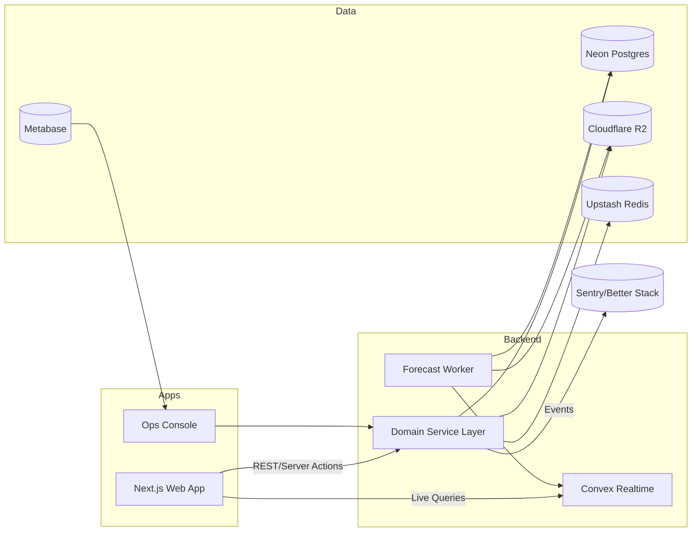
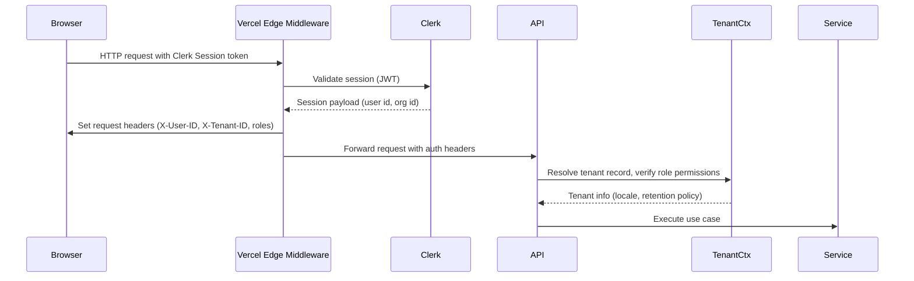
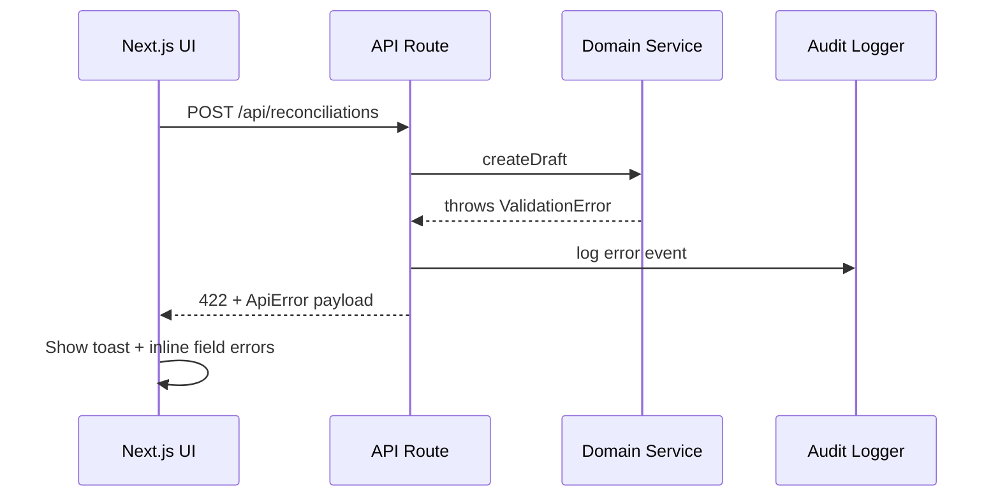

# PharmaSaaS Fullstack Architecture Document

## Introduction
This document outlines the complete fullstack architecture for PharmaSaaS, covering backend services, frontend implementation, data pipelines, and operational workflows required to deliver guided cash reconciliation, inventory intelligence, compliance reporting, and AI forecasting as defined in the PRD. The architecture opts for a pragmatic, modular monolith deployed on managed serverless infrastructure so a two-person team can operate with confidence while meeting the security, uptime, and audit expectations of Moroccan pharmacies.

## Starter Template or Existing Project
N/A – Greenfield project. We will scaffold a Turborepo-based monorepo that bundles the Next.js frontend, a modularized service layer, Convex realtime functions, and Python forecasting worker across shared packages. No legacy constraints exist beyond the preferred stack outlined in the PRD.

## Change Log
| Date       | Version | Description                           | Author |
|------------|---------|---------------------------------------|--------|
| 2025-10-23 | 0.1     | Initial fullstack architecture draft | Architect |

## High Level Architecture

### Technical Summary
- PharmaSaaS runs as a modular monolith fronted by a Next.js App Router application deployed to Vercel. The UI leverages server actions and streaming to hydrate reconciliation dashboards quickly, while API routes in the same app expose a type-safe service layer.
- Core business logic resides in shared domain modules written in TypeScript/Drizzle; they read and write to Neon-hosted PostgreSQL which holds all financial, inventory, and audit records. Cloudflare R2 stores large artifacts (reports, receipts, model files).
- Convex provides realtime synchronization and offline queuing for cash sessions, dashboards, and POS activity. Clients subscribe to live queries so multiple pharmacists see updates instantly.
- A Python worker deployed on Railway ingests transactional events, maintains forecasting feature sets, and retrains demand models nightly; results feed back into Postgres and Convex.
- Clerk powers authentication and role-based access control, wrapping requests via Vercel edge middleware, while Sentry/Better Stack capture observability metrics to satisfy the 99.9% SLA expectation.

### Platform and Infrastructure Choice

**Platform:** Vercel + Neon + Convex + Railway

**Key Services:** Vercel (Next.js, Edge Functions), Neon PostgreSQL (primary database), Convex (realtime sync and optimistic updates), Railway (Python forecasting worker), Cloudflare R2 (object storage), Clerk (auth/RBAC), Upstash Redis (queues & rate limits), Resend (email).

**Deployment Host and Regions:** Vercel FRA1 (primary) with global edge caching; Neon eu-central-1; Convex EU region; Railway eu-west; Cloudflare R2 EU (Frankfurt).

*Options considered:*  
- **AWS Serverless (Amplify + AppSync + Aurora):** single-vendor governance but higher complexity for a small team.  
- **Render/Fly Monolith with custom websockets:** simpler vendor footprint yet lacks managed offline sync and imposes more realtime engineering.

### Repository Structure
**Structure:** Monorepo with shared domain and infrastructure packages.  
**Monorepo Tool:** Turborepo (pnpm workspaces).  
**Package Organization:**
- `apps/web` – Next.js App Router UI + API routes.  
- `apps/forecast-worker` – Python worker (Dockerized) for demand forecasting.  
- `packages/domain` – Financial, inventory, forecasting business logic.  
- `packages/db` – Drizzle schema definitions, SQL migrations, seeding utilities.  
- `packages/ui` – shadcn-based design system shared across apps.  
- `packages/config` – Zod-based environment schema, feature flag helpers.  
- `packages/clients` – Typed service/Convex clients for frontend consumption.  
- `convex/` – Convex functions, schemas, helpers.  
- `infra/` – Terraform modules, state definitions.  
- `scripts/` – Generation, lint, release automation.

#### Repository Bootstrap Checklist
- Product or tech lead creates the monorepo using `pnpm create turbo@latest pharmasaas` (or clones the template repo) and immediately runs `pnpm install` to lock dependencies.
- Initialize git history (`git init`, commit the generated scaffold) and push to the chosen GitHub organization/repository following naming convention `pharmasaas/monorepo`.
- Enable branch protections on `main` before inviting collaborators; seed initial `README.md` with setup excerpts below.
- Create shared secret store in Doppler/1Password and grant access to leads responsible for vendor onboarding (see “Third-Party Service Onboarding Runbook”).
- Log bootstrap completion and links to repo/secret vault in `docs/adr/ADR-<date>-project-bootstrap.md` for traceability.

### High Level Architecture Diagram
```mermaid
graph TD
    subgraph Client
        Browser[Pharmacist Browser / Tablet]
        POS[Counter Device]
    end
    Browser --> SW[Service Worker Cache]
    POS --> SW
    SW -->|HTTPS| CDN[Cloudflare CDN]
    CDN --> Next[Vercel Next.js App]
    Next -->|Edge Auth| Clerk[Clerk]
    Next -->|API Routes| ServiceLayer[TypeScript Domain Services]
    Next -->|Live Queries| Convex[Convex Realtime]
    Convex --> Browser
    ServiceLayer -->|SQL| Postgres[(Neon PostgreSQL)]
    ServiceLayer -->|Files| Storage[(Cloudflare R2)]
    ServiceLayer -->|Queues| Redis[(Upstash Redis)]
    ServiceLayer -->|Emails| Resend[Resend]
    ServiceLayer -->|Metrics| Sentry[Sentry/Better Stack]

    subgraph Data & AI
        Worker[Forecast Worker (Python on Railway)]
        FeatureViews[Feature Store Views]
    end
    Worker -->|Write Forecasts| Postgres
    Worker -->|Publish Recommendations| Convex
    Worker -->|Store Artifacts| Storage
    AdminConsole[Ops Console]
    AdminConsole --> Next
```

### Architectural Patterns
- **Hybrid Modular Monolith + BFF:** Next.js API routes act as a backend-for-frontend into modular service packages; scales vertically while keeping latency low and code discoverable.  
- **Server Components + Convex Realtime:** React Server Components stream initial state while Convex drives optimistic updates, ensuring near-instant reconciliation feedback and offline queue replay.  
- **Repository + Service Pattern:** Drizzle repositories encapsulate SQL; domain services orchestrate audit logging and invariants, supporting testability and potential future service extraction.  
- **Event-Sourced Forecasting:** Sales, returns, and stock events feed Redis queues; the Railway worker calculates features and writes ForecastSnapshot records, decoupling ML workloads from request latency.  
- **Defense-in-Depth Security:** Edge middleware validates Clerk tokens, service layer enforces RBAC, and audit log entries chain hashes for tamper evidence, satisfying compliance checkpoints.

## Tech Stack
| Category | Technology | Version | Purpose | Rationale |
|----------|------------|---------|---------|-----------|
| Frontend Language | TypeScript | 5.3.x | Shared typing across UI and backend | Prevents runtime errors, allows shared domain types |
| Frontend Framework | Next.js (App Router) | 14.x | UI delivery, API routes, server actions | Tight Vercel integration, hybrid SSR/ISR, streaming |
| UI Component Library | shadcn/ui + Tailwind CSS | Latest | Design system implementation | Matches UX spec, rapid composition, accessible defaults |
| State Management | TanStack Query + Convex client | 5.x | Data fetching, caching, realtime updates | Handles optimistic mutations and offline sync |
| Backend Language | TypeScript | 5.3.x | Domain logic, API routes | Shared language reduces context switching |
| Backend Framework | Lightweight Express-compatible handlers within Next API routes (Hono) | 4.x | Structured service layer | Provides middleware + testing ergonomics |
| API Style | REST + websocket-based realtime | v1 | JSON REST for mutations, Convex live queries for reads | Aligns with PRD workflows and offline support |
| Database | Neon PostgreSQL | 15.x | System-of-record, audit logs | ACID guarantees, EU region, branching for previews |
| Cache | Upstash Redis (serverless) | Latest | Job queues, rate limiting, feature evaluation | Serverless, pay-per-request, native Vercel support |
| File Storage | Cloudflare R2 | Latest | Reports, receipts, ML artifacts | Low-cost, S3-compatible in EU |
| Authentication | Clerk | Latest | Auth, RBAC, session management | Turnkey multi-role auth, compliance features |
| Frontend Testing | Vitest + Testing Library + Storybook | Latest | Component/unit regression | Fast TS-native runner, supports UI regression |
| Backend Testing | Vitest (node) + Supertest | Latest | Service/API testing | Reuses runner, simplifies integration tests |
| E2E Testing | Playwright | 1.43.x | Workflow validation on desktop/tablet | Cross-browser, device emulation |
| Build Tool | Turborepo + pnpm | Latest | Task orchestration | Parallel builds, shared caching |
| Bundler | Vite (Storybook) / Next bundler (RSC) | Latest | Packaging | Default Next bundler + Vite for isolated builds |
| IaC Tool | Terraform + Terragrunt | 1.6.x | Provision multi-vendor resources | Avoids configuration drift |
| CI/CD | GitHub Actions | Latest | Test, lint, deploy pipelines | Integrates with Vercel, Neon, Convex deploy hooks |
| Monitoring | Sentry + Vercel Analytics | Latest | Error tracing, performance insights | Unified front/back monitoring |
| Logging | Better Stack (Logtail) | Latest | Centralized structured logs | Queryable, EU storage |
| CSS Framework | Tailwind CSS | 3.x | Utility-first styling | Pairs with shadcn/ui, responsive-ready |

## Data Models

### Tenant
**Purpose:** Represents a pharmacy organization (single location) and centralizes configuration such as currency, locale, and retention policies.

**Key Attributes:**
- `id`: `string` – Global tenant identifier used across systems.
- `legalName`: `string` – Registered pharmacy name for reports.
- `locale`: `string` – Locale code (e.g., `fr-MA`) driving translations.
- `timezone`: `string` – Time zone for scheduling, reporting, and audits.
- `retentionPolicy`: `RetentionPolicy` – Structured settings for data/archive durations.

```typescript
export interface Tenant {
  id: string;
  legalName: string;
  locale: 'fr-MA';
  timezone: string;
  cashVarianceThreshold: number;
  retentionPolicy: {
    financialReportsYears: number;
    auditLogYears: number;
    anonymizationDays: number;
  };
  createdAt: string;
  updatedAt: string;
}
```

- User belongs to Tenant (many users per tenant)  
- InventoryItem, CashSession, Report all reference Tenant  
- Tenant has many FeatureFlag overrides and Integrations  

### User
**Purpose:** Authenticated pharmacist, staff, or advisor using the platform with role-based permissions.

**Key Attributes:**
- `id`: `string` – Clerk user id cross-referenced in our system.
- `tenantId`: `string` – Links to Tenant for scoping.
- `role`: `UserRole` – Owner, Manager, Cashier, Accountant, Auditor.
- `status`: `UserStatus` – Active, Suspended, Invited.
- `lastActiveAt`: `string` – ISO timestamp for compliance/audit reporting.

```typescript
export interface User {
  id: string;
  tenantId: string;
  role: 'owner' | 'manager' | 'cashier' | 'accountant' | 'auditor';
  status: 'active' | 'suspended' | 'invited';
  displayName: string;
  email: string;
  phone?: string;
  mfaEnabled: boolean;
  lastActiveAt?: string;
  createdAt: string;
  updatedAt: string;
}
```

- User belongs to Tenant  
- CashSession, CashReconciliation reference User (initiatedBy/approvedBy)  
- AuditLogEntry records User actions  

### CashSession
**Purpose:** Represents a POS operating period (e.g., daily shift) aggregating sales and cash counts for reconciliation.

**Key Attributes:**
- `id`: `string` – Session identifier.
- `tenantId`: `string` – Tenant scope for queries.
- `openedBy`: `string` – User id who opened the session.
- `status`: `CashSessionStatus` – Open, PendingReconciliation, Closed.
- `expectedTotals`: `CashBreakdown` – Computed totals per tender type.

```typescript
export interface CashSession {
  id: string;
  tenantId: string;
  openedBy: string;
  closedBy?: string;
  status: 'open' | 'pending_reconciliation' | 'closed';
  openedAt: string;
  closedAt?: string;
  expectedTotals: CashBreakdown;
  offlineTransactionCount: number;
  createdAt: string;
  updatedAt: string;
}

export interface CashBreakdown {
  madCash: number;
  card: number;
  mobileWallet: number;
  other: number;
}
```

- CashSession aggregates many SalesTransaction records  
- CashReconciliation references the CashSession being reconciled  
- OfflineQueueEntry ties to CashSession during outages  

### CashReconciliation
**Purpose:** Captures the guided reconciliation workflow resolving discrepancies between expected and counted cash.

**Key Attributes:**
- `id`: `string` – Reconciliation identifier.
- `tenantId`: `string` – Tenant scope.
- `cashSessionId`: `string` – Session being reconciled.
- `initiatedBy`: `string` – User starting the reconciliation.
- `status`: `ReconciliationStatus` – Draft, Escalated, Closed.
- `variance`: `number` – MAD difference (positive = over, negative = short).
- `resolutionSteps`: `ReconciliationStep[]` – Ordered steps performed.

```typescript
export interface CashReconciliation {
  id: string;
  tenantId: string;
  cashSessionId: string;
  initiatedBy: string;
  approvedBy?: string;
  status: 'draft' | 'escalated' | 'closed';
  countedTotals: CashBreakdown;
  expectedTotals: CashBreakdown;
  variance: number;
  resolutionSteps: ReconciliationStep[];
  notes?: string;
  createdAt: string;
  updatedAt: string;
}

export interface ReconciliationStep {
  id: string;
  type: 'adjustment' | 'transaction_fix' | 'escalation' | 'write_off';
  description: string;
  amountImpact: number;
  performedBy: string;
  performedAt: string;
  metadata?: Record<string, unknown>;
}
```

- CashReconciliation belongs to CashSession  
- Produces AuditLogEntry records per resolution step  
- Can link to ForecastAdjustment when anomalies affect models  

### InventoryItem
**Purpose:** Represents a SKU with pricing, stock status, and regulatory attributes, feeding dashboards and forecasting.

**Key Attributes:**
- `id`: `string` – SKU identifier (internal).
- `tenantId`: `string` – Tenant scope.
- `name`: `string` – Localized name (French primary).
- `category`: `string` – OTC, Prescription, Preparation, etc.
- `currentStock`: `number` – In base units.

```typescript
export interface InventoryItem {
  id: string;
  tenantId: string;
  supplierId?: string;
  name: string;
  frenchLabel: string;
  category: 'otc' | 'rx' | 'preparation' | 'consumable';
  barcode?: string;
  reorderPoint: number;
  reorderQuantity: number;
  unitCost: number;
  retailPrice: number;
  currentStock: number;
  stockStatus: 'healthy' | 'low' | 'critical' | 'out';
  expiryTracked: boolean;
  lastCountedAt?: string;
  createdAt: string;
  updatedAt: string;
}
```

- InventoryItem has many StockBatch records (lot/expiry)  
- Supplier supplies InventoryItem (optional)  
- ForecastSnapshot references InventoryItem demand projections  

### StockBatch
**Purpose:** Tracks batch/lot-level inventory with expiry, supporting compliance and recall actions.

**Key Attributes:**
- `id`: `string` – Batch identifier.
- `inventoryItemId`: `string` – Associated SKU.
- `batchNumber`: `string` – Supplier batch/lot number.
- `expiryDate`: `string` – ISO expiry date.
- `quantityOnHand`: `number` – Remaining units in batch.

```typescript
export interface StockBatch {
  id: string;
  tenantId: string;
  inventoryItemId: string;
  batchNumber: string;
  manufactureDate?: string;
  expiryDate: string;
  quantityOnHand: number;
  reservedQuantity: number;
  receivedAt: string;
  createdAt: string;
  updatedAt: string;
}
```

- StockBatch belongs to InventoryItem  
- PurchaseOrderLine creates StockBatch entries  
- ForecastSnapshot considers earliest expiry for reorder urgency  

### ForecastSnapshot
**Purpose:** Stores daily demand forecasts, confidence bands, and recommended reorder quantities for each SKU.

**Key Attributes:**
- `id`: `string` – Snapshot identifier.
- `inventoryItemId`: `string` – SKU in scope.
- `forecastDate`: `string` – Date of prediction horizon.
- `expectedDemand`: `number` – Units predicted for the horizon window.
- `recommendation`: `ForecastRecommendation` – e.g., reorder amount, hold, investigate.

```typescript
export interface ForecastSnapshot {
  id: string;
  tenantId: string;
  inventoryItemId: string;
  generatedAt: string;
  horizonDays: number;
  expectedDemand: number;
  confidenceLow: number;
  confidenceHigh: number;
  recommendedOrderQty: number;
  rationale: string;
  modelVersion: string;
  createdAt: string;
}
```

- ForecastSnapshot references InventoryItem  
- ForecastFeedback ties to ForecastSnapshot for accuracy loop  
- ReorderRecommendation event consumes ForecastSnapshot  

### SupplierOrder
**Purpose:** Tracks supplier purchase orders from creation through receipt and reconciliation against stock.

**Key Attributes:**
- `id`: `string` – Purchase order id.
- `tenantId`: `string` – Tenant scope.
- `supplierId`: `string` – Supplier reference.
- `status`: `SupplierOrderStatus` – Draft, Submitted, PartiallyReceived, Closed.
- `totalAmount`: `number` – Expected total cost.

```typescript
export interface SupplierOrder {
  id: string;
  tenantId: string;
  supplierId: string;
  status: 'draft' | 'submitted' | 'partially_received' | 'closed' | 'cancelled';
  expectedDeliveryDate?: string;
  totalAmount: number;
  currency: 'MAD';
  createdBy: string;
  lineItems: SupplierOrderLine[];
  createdAt: string;
  updatedAt: string;
}

export interface SupplierOrderLine {
  id: string;
  inventoryItemId: string;
  quantityOrdered: number;
  quantityReceived: number;
  unitCost: number;
  batchNumber?: string;
}
```

- SupplierOrder belongs to Tenant and references Supplier  
- Goods receipt creates StockBatch entries and updates InventoryItem stock  
- CashReconciliation may reference SupplierOrder when variance caused by stock intake  

### AuditLogEntry
**Purpose:** Immutable ledger of sensitive actions for compliance (role changes, reconciliations, financial reports).

**Key Attributes:**
- `id`: `string` – Log entry id.
- `tenantId`: `string` – Tenant scope.
- `eventType`: `AuditEventType` – Enum (role_change, reconciliation_closed, report_generated, etc.).
- `performedBy`: `string` – User id or system service.
- `metadata`: `Record<string, unknown>` – Canonical details hashed for tamper evidence.
- `hash`: `string` – Hash chain value linking to previous entries.

```typescript
export interface AuditLogEntry {
  id: string;
  tenantId: string;
  eventType: AuditEventType;
  performedBy: string;
  performedAt: string;
  resourceType: string;
  resourceId: string;
  metadata: Record<string, unknown>;
  previousHash?: string;
  hash: string;
  createdAt: string;
}
```

- AuditLogEntry references User (nullable for system)  
- CashReconciliation, SupplierOrder, Report generation all emit AuditLogEntry  
- Immutable chain validated during compliance checks  

## API Specification
```yaml
openapi: 3.0.3
info:
  title: PharmaSaaS API
  version: 1.0.0
  description: >
    REST APIs that power reconciliation, inventory, forecasting, and compliance workflows.
    All requests require Clerk-issued bearer tokens and tenant scoping headers.
servers:
  - url: https://api.pharmasaas.com
    description: Production
  - url: https://staging.api.pharmasaas.com
    description: Staging sandbox
security:
  - bearerAuth: []
  - clerkSession: []
paths:
  /api/cash-sessions:
    get:
      summary: List cash sessions for current tenant
      parameters:
        - in: query
          name: status
          schema:
            type: string
            enum: [open, pending_reconciliation, closed]
        - in: query
          name: from
          schema:
            type: string
            format: date-time
        - in: query
          name: to
          schema:
            type: string
            format: date-time
      responses:
        '200':
          description: Cash sessions
          content:
            application/json:
              schema:
                $ref: '#/components/schemas/CashSessionList'
    post:
      summary: Open a new cash session
      requestBody:
        required: true
        content:
          application/json:
            schema:
              $ref: '#/components/schemas/OpenCashSessionRequest'
      responses:
        '201':
          description: Session created
          headers:
            Location:
              schema:
                type: string
        '409':
          description: Session already open for register
  /api/cash-sessions/{sessionId}:
    get:
      summary: Get session details
      parameters:
        - $ref: '#/components/parameters/SessionId'
      responses:
        '200':
          description: Session detail
          content:
            application/json:
              schema:
                $ref: '#/components/schemas/CashSession'
  /api/cash-sessions/{sessionId}/close:
    post:
      summary: Close session and move to reconciliation
      parameters:
        - $ref: '#/components/parameters/SessionId'
      responses:
        '202':
          description: Session pending reconciliation
  /api/reconciliations:
    post:
      summary: Start reconciliation on a cash session
      requestBody:
        required: true
        content:
          application/json:
            schema:
              $ref: '#/components/schemas/CreateReconciliationRequest'
      responses:
        '201':
          description: Reconciliation started
    get:
      summary: List reconciliation records
      responses:
        '200':
          description: Reconciliation collection
          content:
            application/json:
              schema:
                $ref: '#/components/schemas/ReconciliationList'
  /api/reconciliations/{reconciliationId}:
    patch:
      summary: Append resolution steps
      requestBody:
        required: true
        content:
          application/json:
            schema:
              $ref: '#/components/schemas/AddResolutionStepRequest'
      responses:
        '200':
          description: Updated reconciliation
    post:
      summary: Submit reconciliation for approval / closure
      responses:
        '202':
          description: Submitted for approval
  /api/inventory/items:
    get:
      summary: Search inventory catalog
      parameters:
        - in: query
          name: q
          schema:
            type: string
        - in: query
          name: status
          schema:
            type: string
            enum: [healthy, low, critical, out]
      responses:
        '200':
          content:
            application/json:
              schema:
                $ref: '#/components/schemas/InventoryItemList'
    post:
      summary: Create or import inventory item
      requestBody:
        content:
          application/json:
            schema:
              $ref: '#/components/schemas/CreateInventoryItemRequest'
      responses:
        '201':
          description: Item created
  /api/inventory/items/{itemId}:
    patch:
      summary: Update pricing/metadata
      requestBody:
        content:
          application/json:
            schema:
              $ref: '#/components/schemas/UpdateInventoryItemRequest'
      responses:
        '200':
          content:
            application/json:
              schema:
                $ref: '#/components/schemas/InventoryItem'
  /api/inventory/items/{itemId}/counts:
    post:
      summary: Record stock count or adjustment
      requestBody:
        content:
          application/json:
            schema:
              $ref: '#/components/schemas/InventoryAdjustmentRequest'
      responses:
        '201':
          description: Adjustment logged
  /api/forecasts/snapshots:
    get:
      summary: Retrieve forecast snapshots for dashboard
      parameters:
        - in: query
          name: horizonDays
          schema:
            type: integer
            default: 7
      responses:
        '200':
          content:
            application/json:
              schema:
                $ref: '#/components/schemas/ForecastSnapshotList'
  /api/forecasts/feedback:
    post:
      summary: Capture feedback on forecast accuracy
      requestBody:
        content:
          application/json:
            schema:
              $ref: '#/components/schemas/ForecastFeedbackRequest'
      responses:
        '202':
          description: Feedback accepted
  /api/supplier-orders:
    post:
      summary: Create supplier order
      requestBody:
        content:
          application/json:
            schema:
              $ref: '#/components/schemas/CreateSupplierOrderRequest'
      responses:
        '201':
          description: Order created
    get:
      summary: List supplier orders
      responses:
        '200':
          content:
            application/json:
              schema:
                $ref: '#/components/schemas/SupplierOrderList'
  /api/supplier-orders/{orderId}/receive:
    post:
      summary: Receive goods and update batches
      requestBody:
        content:
          application/json:
            schema:
              $ref: '#/components/schemas/ReceiveSupplierOrderRequest'
      responses:
        '200':
          description: Receipt processed
  /api/reports/cash-journal:
    get:
      summary: Generate cash journal report
      parameters:
        - in: query
          name: date
          required: true
          schema:
            type: string
            format: date
      responses:
        '200':
          description: Report download link
          content:
            application/json:
              schema:
                $ref: '#/components/schemas/ReportLink'
  /api/audit-log:
    get:
      summary: Query audit trail
      parameters:
        - in: query
          name: eventType
          schema:
            type: string
        - in: query
          name: from
          schema:
            type: string
            format: date-time
        - in: query
          name: to
          schema:
            type: string
            format: date-time
      responses:
        '200':
          content:
            application/json:
              schema:
                $ref: '#/components/schemas/AuditLogList'
components:
  securitySchemes:
    bearerAuth:
      type: http
      scheme: bearer
      bearerFormat: JWT
    clerkSession:
      type: apiKey
      in: header
      name: Clerk-Session-Id
  parameters:
    SessionId:
      in: path
      name: sessionId
      required: true
      schema:
        type: string
    ReconciliationId:
      in: path
      name: reconciliationId
      required: true
      schema:
        type: string
  schemas:
    CashSession:
      type: object
      required: [id, tenantId, status, expectedTotals]
      properties:
        id:
          type: string
        tenantId:
          type: string
        status:
          type: string
          enum: [open, pending_reconciliation, closed]
        openedAt:
          type: string
          format: date-time
        expectedTotals:
          $ref: '#/components/schemas/CashBreakdown'
        offlineTransactionCount:
          type: integer
    CashSessionList:
      type: object
      properties:
        data:
          type: array
          items:
            $ref: '#/components/schemas/CashSession'
    CashBreakdown:
      type: object
      properties:
        madCash:
          type: number
          format: float
        card:
          type: number
          format: float
        mobileWallet:
          type: number
          format: float
        other:
          type: number
          format: float
    OpenCashSessionRequest:
      type: object
      required: [registerId, openingFloat]
      properties:
        registerId:
          type: string
        openingFloat:
          $ref: '#/components/schemas/CashBreakdown'
    Reconciliation:
      type: object
      required: [id, cashSessionId, status, variance]
      properties:
        id:
          type: string
        cashSessionId:
          type: string
        status:
          type: string
          enum: [draft, escalated, closed]
        countedTotals:
          $ref: '#/components/schemas/CashBreakdown'
        variance:
          type: number
          format: float
        resolutionSteps:
          type: array
          items:
            $ref: '#/components/schemas/ReconciliationStep'
    ReconciliationStep:
      type: object
      required: [type, description, amountImpact]
      properties:
        type:
          type: string
          enum: [adjustment, transaction_fix, escalation, write_off]
        description:
          type: string
        amountImpact:
          type: number
        performedBy:
          type: string
        performedAt:
          type: string
          format: date-time
    CreateReconciliationRequest:
      type: object
      required: [cashSessionId, countedTotals]
      properties:
        cashSessionId:
          type: string
        countedTotals:
          $ref: '#/components/schemas/CashBreakdown'
        notes:
          type: string
    AddResolutionStepRequest:
      type: object
      required: [step]
      properties:
        step:
          $ref: '#/components/schemas/ReconciliationStep'
    InventoryItem:
      type: object
      required: [id, name, category, currentStock]
      properties:
        id:
          type: string
        name:
          type: string
        category:
          type: string
        barcode:
          type: string
        stockStatus:
          type: string
          enum: [healthy, low, critical, out]
        reorderPoint:
          type: integer
        reorderQuantity:
          type: integer
        unitCost:
          type: number
        retailPrice:
          type: number
    InventoryItemList:
      type: object
      properties:
        data:
          type: array
          items:
            $ref: '#/components/schemas/InventoryItem'
    CreateInventoryItemRequest:
      type: object
      required: [name, category, unitCost, retailPrice]
      properties:
        name:
          type: string
        frenchLabel:
          type: string
        category:
          type: string
        reorderPoint:
          type: integer
        reorderQuantity:
          type: integer
        unitCost:
          type: number
        retailPrice:
          type: number
        expiryTracked:
          type: boolean
    UpdateInventoryItemRequest:
      type: object
      properties:
        reorderPoint:
          type: integer
        reorderQuantity:
          type: integer
        unitCost:
          type: number
        retailPrice:
          type: number
        status:
          type: string
    InventoryAdjustmentRequest:
      type: object
      required: [quantityDelta, reason]
      properties:
        quantityDelta:
          type: integer
        reason:
          type: string
          enum: [count, damage, expiry, correction]
        note:
          type: string
    ForecastSnapshot:
      type: object
      required: [id, inventoryItemId, expectedDemand]
      properties:
        id:
          type: string
        inventoryItemId:
          type: string
        generatedAt:
          type: string
          format: date-time
        horizonDays:
          type: integer
        expectedDemand:
          type: number
          format: float
        confidenceLow:
          type: number
        confidenceHigh:
          type: number
        recommendedOrderQty:
          type: number
        rationale:
          type: string
    ForecastSnapshotList:
      type: object
      properties:
        data:
          type: array
          items:
            $ref: '#/components/schemas/ForecastSnapshot'
    ForecastFeedbackRequest:
      type: object
      required: [snapshotId, verdict]
      properties:
        snapshotId:
          type: string
        verdict:
          type: string
          enum: [accurate, under, over]
        comment:
          type: string
    SupplierOrder:
      type: object
      required: [id, supplierId, status, totalAmount]
      properties:
        id:
          type: string
        supplierId:
          type: string
        status:
          type: string
          enum: [draft, submitted, partially_received, closed, cancelled]
        expectedDeliveryDate:
          type: string
          format: date
        totalAmount:
          type: number
        lineItems:
          type: array
          items:
            $ref: '#/components/schemas/SupplierOrderLine'
    SupplierOrderLine:
      type: object
      properties:
        inventoryItemId:
          type: string
        quantityOrdered:
          type: integer
        quantityReceived:
          type: integer
        unitCost:
          type: number
        batchNumber:
          type: string
    SupplierOrderList:
      type: object
      properties:
        data:
          type: array
          items:
            $ref: '#/components/schemas/SupplierOrder'
    CreateSupplierOrderRequest:
      type: object
      required: [supplierId, lineItems]
      properties:
        supplierId:
          type: string
        lineItems:
          type: array
          items:
            $ref: '#/components/schemas/SupplierOrderLine'
    ReceiveSupplierOrderRequest:
      type: object
      required: [deliveryDate, lineItems]
      properties:
        deliveryDate:
          type: string
          format: date
        lineItems:
          type: array
          items:
            type: object
            required: [lineId, quantityReceived, expiryDate]
            properties:
              lineId:
                type: string
              quantityReceived:
                type: integer
              expiryDate:
                type: string
                format: date
              batchNumber:
                type: string
    ReportLink:
      type: object
      required: [url, expiresAt]
      properties:
        url:
          type: string
          format: uri
        expiresAt:
          type: string
          format: date-time
    AuditLogEntry:
      type: object
      required: [id, eventType, performedBy, performedAt]
      properties:
        id:
          type: string
        eventType:
          type: string
        performedBy:
          type: string
        performedAt:
          type: string
          format: date-time
        resourceType:
          type: string
        resourceId:
          type: string
        metadata:
          type: object
          additionalProperties: true
        hash:
          type: string
    AuditLogList:
      type: object
      properties:
        data:
          type: array
          items:
            $ref: '#/components/schemas/AuditLogEntry'
```

## Components

**Web App (Next.js)**
**Responsibility:** Render pharmacist dashboards, reconciliation wizard, POS workflows, and orchestrate API/Convex calls.

**Key Interfaces:**
- `GET/POST /api/*` via server actions and REST helpers
- Convex live queries/mutations for realtime data

**Dependencies:** Clerk middleware, shared UI/domain packages, TanStack Query cache

**Technology Stack:** Next.js 14 App Router, shadcn/ui, Tailwind, Convex client, TanStack Query

**Domain Service Layer**
**Responsibility:** Enforce business rules for cash handling, inventory, compliance, and persist data changes.

**Key Interfaces:**
- REST handlers under `/api` (Hono/Express-style)
- Drizzle repositories for Postgres access

**Dependencies:** Neon Postgres, Upstash Redis, Zod validators, Audit logger

**Technology Stack:** TypeScript, Drizzle ORM, Hono handlers inside Next API routes

**Convex Realtime Workspace**
**Responsibility:** Maintain live state (cash session dashboards, offline queue) and distribute optimistic updates.

**Key Interfaces:**
- Convex queries (`cashSessionLive`, `inventoryAlerts`)
- Convex mutations for offline transaction replay

**Dependencies:** Postgres via service layer webhooks, Clerk auth integration

**Technology Stack:** Convex functions, auth middleware, TypeScript schemas

**Forecast & Analytics Worker**
**Responsibility:** Generate demand forecasts, reconcile feedback, and publish recommendations.

**Key Interfaces:**
- Postgres (feature views, snapshots)
- Convex publish hooks for alert cards
- R2 storage for model artifacts

**Dependencies:** Upstash Redis event queue, Metabase for telemetry

**Technology Stack:** Python 3.12, Prophet, scikit-learn, Railway deployment

**Data Platform & Storage**
**Responsibility:** Persist transactional, audit, and document data with compliance guarantees.

**Key Interfaces:**
- Drizzle migrations & SQL views
- R2 storage operations

**Dependencies:** Neon branching for previews, hash-chain audit triggers

**Technology Stack:** Neon PostgreSQL 15, Cloudflare R2, SQL functions

**Observability & Ops Console**
**Responsibility:** Aggregate logs/metrics, provide dashboards, and run operational scripts.

**Key Interfaces:**
- Sentry SDK, Better Stack ingestion
- Metabase dashboards hitting read replica
- Internal ops console UI for QA

**Dependencies:** GitHub Actions alerts, Terraform-managed secrets

**Technology Stack:** Sentry, Better Stack Logtail, Metabase Cloud, lightweight Next.js admin app



## External APIs
- **Clerk API**
  - **Purpose:** Authentication, organization management, MFA enforcement, session validation
  - **Documentation:** https://clerk.com/docs
  - **Base URL(s):** `https://api.clerk.dev`
  - **Authentication:** Backend secret key (Bearer); frontend uses publishable key with JWT handoff
  - **Rate Limits:** 1000 requests/minute per key (soft); monitor via Clerk dashboard
  - **Key Endpoints Used:**
    - `GET /v1/users/{id}` – Retrieve roles after webhook events
    - `POST /v1/organizations/{id}/memberships` – Manage tenant memberships
  - **Integration Notes:** Verify HMAC signatures on webhooks; all role updates flow through backend service to preserve audit trail.

- **Resend API**
  - **Purpose:** Send transactional emails (reconciliation summaries, escalations, report links)
  - **Documentation:** https://resend.com/docs
  - **Base URL(s):** `https://api.resend.com`
  - **Authentication:** API key in `Authorization: Bearer`
  - **Rate Limits:** 600 requests/minute; exponential back-off on 429 responses
  - **Key Endpoints Used:**
    - `POST /emails` – Send localized HTML templates
  - **Integration Notes:** Queue retries through Upstash when Resend throttles; French copy is default locale.

- **Convex Managed Functions**
  - **Purpose:** Realtime queries and mutations powering dashboards and offline replay
  - **Documentation:** https://docs.convex.dev
  - **Base URL(s):** `https://{deployment}.convex.cloud`
  - **Authentication:** Convex token derived from Clerk session (signed JWT)
  - **Rate Limits:** Soft limit ~200 req/sec; monitor usage in Convex console
  - **Key Interfaces:** Generated Convex client methods (`mutation`, `query`)
  - **Integration Notes:** Keep mutations idempotent; configure exponential retries in service worker for offline sync.

No additional third-party APIs required for MVP; bank feeds/government integrations tracked for post-launch.

## Core Workflows
```mermaid
sequenceDiagram
    participant User as Pharmacist
    participant Web as Next.js UI
    participant Convex as Convex Realtime
    participant API as Domain Service Layer
    participant DB as Neon Postgres
    participant Audit as Audit Logger

    User->>Web: Launch reconciliation wizard
    Web->>Convex: Subscribe cashSessionLive(sessionId)
    Convex-->>Web: Stream expected totals & variance
    User->>Web: Enter counted cash
    Web->>API: POST /api/reconciliations {countedTotals}
    API->>DB: Insert reconciliation draft
    API->>Audit: Log reconciliation_started
    API-->>Web: 201 Created
    API-->>Convex: mutation updateReconciliationDraft
    Convex-->>Web: Updated variance & steps
    User->>Web: Add resolution step
    Web->>API: PATCH /api/reconciliations/{id} {step}
    API->>DB: Insert resolution step; update variance
    API->>Audit: Log reconciliation_step
    API-->>Web: 200 OK
    API-->>Convex: mutation pushStep
    Convex-->>Web: Stream new step
    User->>Web: Submit reconciliation
    Web->>API: POST /api/reconciliations/{id} (submit)
    API->>DB: Update status=closed
    API->>Audit: Log reconciliation_closed
    API-->>Web: 202 Accepted
    API-->>Convex: mutation finalizeReconciliation
    Convex-->>Web: status closed, variance 0
```

**Rationale**
- Trade-offs: Treated Convex as external API to highlight auth/usage boundaries; ensures plan factors vendor lock-in mitigation. Sequence diagram focuses on reconciliation since it’s most critical workflow; future diagrams can capture inventory intake once supplier integrations mature. Assumed offline events replay through Convex to avoid exposing raw Postgres externally.
- Assumptions: Clerk webhooks drive role changes, so backend must handle them idempotently. Convex tokens expire quickly; service worker refreshes via `/api/auth/convex-token` endpoint. Resend handles PDF links pointing to R2 objects signed via temporary URLs.
- Validation: Confirm legal review approves EU-hosted Clerk/Resend; ensure pharmacy-specific email templates meet compliance copy before go-live.

1. Proceed to next section  
2. Explain Reasoning (CoT Step-by-Step)  
3. Critique and Refine  
4. Assess Alignment with Overall Goals  
5. Identify Potential Risks and Unforeseen Issues  
6. Agile Team Perspective Shift  
7. Stakeholder Round Table  
8. Tree of Thoughts Deep Dive  
9. Challenge from Critical Perspective  

Select 1-9 or just type your question/feedback:

## Database Schema

### Schema Design
```sql
-- Tenants and configuration
create table tenants (
  id uuid primary key,
  legal_name text not null,
  locale text not null default 'fr-MA',
  timezone text not null,
  cash_variance_threshold numeric(12,2) not null default 50,
  retention_financial_years int not null default 10,
  retention_audit_years int not null default 10,
  anonymization_days int not null default 365,
  created_at timestamptz not null default now(),
  updated_at timestamptz not null default now()
);
create index tenants_timezone_idx on tenants(timezone);

-- Users (Clerk linked)
create table users (
  id uuid primary key,
  tenant_id uuid references tenants(id) on delete cascade,
  role text not null check (role in ('owner','manager','cashier','accountant','auditor')),
  status text not null check (status in ('active','suspended','invited')),
  display_name text not null,
  email text not null,
  phone text,
  mfa_enabled boolean not null default false,
  last_active_at timestamptz,
  created_at timestamptz not null default now(),
  updated_at timestamptz not null default now()
);
create index users_tenant_role_idx on users(tenant_id, role);

-- Cash sessions and reconciliation
create table cash_sessions (
  id uuid primary key,
  tenant_id uuid references tenants(id) on delete cascade,
  opened_by uuid references users(id),
  closed_by uuid references users(id),
  register_id text not null,
  status text not null check (status in ('open','pending_reconciliation','closed')),
  opened_at timestamptz not null default now(),
  closed_at timestamptz,
  expected_mad_cash numeric(12,2) not null default 0,
  expected_card numeric(12,2) not null default 0,
  expected_mobile_wallet numeric(12,2) not null default 0,
  expected_other numeric(12,2) not null default 0,
  offline_transaction_count int not null default 0
);
create index cash_sessions_tenant_status_idx on cash_sessions(tenant_id, status, opened_at desc);

create table cash_reconciliations (
  id uuid primary key,
  tenant_id uuid references tenants(id) on delete cascade,
  cash_session_id uuid references cash_sessions(id) on delete cascade,
  initiated_by uuid references users(id),
  approved_by uuid references users(id),
  status text not null check (status in ('draft','escalated','closed')),
  counted_mad_cash numeric(12,2) not null default 0,
  counted_card numeric(12,2) not null default 0,
  counted_mobile_wallet numeric(12,2) not null default 0,
  counted_other numeric(12,2) not null default 0,
  variance numeric(12,2) not null,
  notes text,
  created_at timestamptz not null default now(),
  updated_at timestamptz not null default now()
);
create index cash_reconciliations_session_idx on cash_reconciliations(cash_session_id);

create table cash_reconciliation_steps (
  id uuid primary key,
  reconciliation_id uuid references cash_reconciliations(id) on delete cascade,
  type text not null check (type in ('adjustment','transaction_fix','escalation','write_off')),
  description text not null,
  amount_impact numeric(12,2) not null,
  performed_by uuid references users(id),
  performed_at timestamptz not null default now(),
  metadata jsonb
);
create index cash_reconciliation_steps_recon_idx on cash_reconciliation_steps(reconciliation_id);

-- Inventory
create table inventory_items (
  id uuid primary key,
  tenant_id uuid references tenants(id) on delete cascade,
  supplier_id uuid,
  name text not null,
  french_label text not null,
  category text not null,
  barcode text,
  reorder_point int not null default 0,
  reorder_quantity int not null default 0,
  unit_cost numeric(12,2) not null,
  retail_price numeric(12,2) not null,
  current_stock int not null default 0,
  stock_status text not null,
  expiry_tracked boolean not null default false,
  last_counted_at timestamptz,
  created_at timestamptz not null default now(),
  updated_at timestamptz not null default now()
);
create index inventory_items_tenant_category_idx on inventory_items(tenant_id, category);
create unique index inventory_items_barcode_unique on inventory_items(tenant_id, barcode) where barcode is not null;

create table stock_batches (
  id uuid primary key,
  tenant_id uuid references tenants(id) on delete cascade,
  inventory_item_id uuid references inventory_items(id) on delete cascade,
  batch_number text not null,
  manufacture_date date,
  expiry_date date not null,
  quantity_on_hand int not null,
  reserved_quantity int not null default 0,
  received_at timestamptz not null default now(),
  created_at timestamptz not null default now()
);
create index stock_batches_item_expiry_idx on stock_batches(inventory_item_id, expiry_date);

-- Forecasting
create table forecast_snapshots (
  id uuid primary key,
  tenant_id uuid references tenants(id) on delete cascade,
  inventory_item_id uuid references inventory_items(id) on delete cascade,
  generated_at timestamptz not null,
  horizon_days int not null,
  expected_demand numeric(12,2) not null,
  confidence_low numeric(12,2) not null,
  confidence_high numeric(12,2) not null,
  recommended_order_qty numeric(12,2) not null,
  rationale text,
  model_version text not null
);
create index forecast_snapshots_item_generated_idx on forecast_snapshots(inventory_item_id, generated_at desc);

-- Supplier orders
create table supplier_orders (
  id uuid primary key,
  tenant_id uuid references tenants(id) on delete cascade,
  supplier_id uuid,
  status text not null check (status in ('draft','submitted','partially_received','closed','cancelled')),
  expected_delivery_date date,
  total_amount numeric(12,2) not null,
  currency text not null default 'MAD',
  created_by uuid references users(id),
  created_at timestamptz not null default now(),
  updated_at timestamptz not null default now()
);
create index supplier_orders_tenant_status_idx on supplier_orders(tenant_id, status);

create table supplier_order_lines (
  id uuid primary key,
  supplier_order_id uuid references supplier_orders(id) on delete cascade,
  inventory_item_id uuid references inventory_items(id),
  quantity_ordered int not null,
  quantity_received int not null default 0,
  unit_cost numeric(12,2) not null,
  batch_number text,
  expiry_date date,
  created_at timestamptz not null default now()
);
create index supplier_order_lines_order_idx on supplier_order_lines(supplier_order_id);

-- Audit log (hash chained)
create table audit_log_entries (
  id uuid primary key,
  tenant_id uuid references tenants(id) on delete cascade,
  event_type text not null,
  performed_by uuid,
  performed_at timestamptz not null default now(),
  resource_type text not null,
  resource_id text not null,
  metadata jsonb not null,
  previous_hash bytea,
  hash bytea not null
);
create index audit_log_entries_tenant_event_idx on audit_log_entries(tenant_id, event_type, performed_at desc);
```

### Data Access Layer
```typescript
// packages/db/repositories/cashReconciliationRepo.ts
import { db } from './client';
import { cashReconciliations, cashReconciliationSteps } from '../schema';
import { eq } from 'drizzle-orm';

export class CashReconciliationRepository {
  async createDraft(payload: {
    id: string;
    tenantId: string;
    cashSessionId: string;
    initiatedBy: string;
    countedTotals: { madCash: number; card: number; mobileWallet: number; other: number };
    variance: number;
  }) {
    await db.insert(cashReconciliations).values({
      id: payload.id,
      tenantId: payload.tenantId,
      cashSessionId: payload.cashSessionId,
      initiatedBy: payload.initiatedBy,
      countedMadCash: payload.countedTotals.madCash,
      countedCard: payload.countedTotals.card,
      countedMobileWallet: payload.countedTotals.mobileWallet,
      countedOther: payload.countedTotals.other,
      variance: payload.variance,
      status: 'draft',
    });
  }

  async appendStep(reconciliationId: string, step: {
    id: string;
    type: 'adjustment' | 'transaction_fix' | 'escalation' | 'write_off';
    description: string;
    amountImpact: number;
    performedBy: string;
    metadata?: Record<string, unknown>;
  }) {
    await db.insert(cashReconciliationSteps).values({
      id: step.id,
      reconciliationId,
      type: step.type,
      description: step.description,
      amountImpact: step.amountImpact,
      performedBy: step.performedBy,
      metadata: step.metadata ?? {},
    });
  }

  async close(reconciliationId: string, approvedBy: string) {
    await db.update(cashReconciliations)
      .set({ status: 'closed', approvedBy, updatedAt: new Date() })
      .where(eq(cashReconciliations.id, reconciliationId));
  }
}
```

### Data Migration & Recovery

- **Initial Migration:** Build import pipelines in `scripts/migrate-legacy/` that transform CSV/Excel exports from incumbent pharmacy tools into the normalized schema. Migrations run through Drizzle seed scripts so every record has audit metadata (source system, import batch). Dry-run command (`pnpm run db:migrate:simulate`) validates referential integrity before committing.
- **Ongoing Backups:** Neon PITR (point-in-time recovery) enabled with 24-hour granularity and daily logical dumps encrypted with KMS-managed keys, stored in Cloudflare R2 replication bucket (`r2://pharmasaas-backups`). R2 itself schedules lifecycle rules for 30-day hot + 365-day cold retention, satisfying compliance durations from the PRD.
- **Recovery Playbook:** Document RTO/RPO targets (RTO ≤ 2h, RPO ≤ 15m). Restoration sequence: pause Convex mutations → restore Neon branch from PITR snapshot → rehydrate R2 artifacts → replay Convex journal if needed → resume traffic after smoke tests.
- **Disaster Drills:** Quarterly chaos exercise spins up staging from backups to ensure scripts remain reliable and that hash-chained audit logs survive restoration.
- **Data Purging:** Implement retention jobs (Railway worker) honoring tenant-specific anonymization days defined on `Tenant.retentionPolicy`, ensuring compliance and keeping storage predictable.

**Rationale**
- Trade-offs: Kept schema normalized for auditability and analytics; avoided storing cash totals as JSON to support aggregate queries. Forecast snapshots separated from transactional writes to minimize lock contention. Supplier orders allow nullable supplier_id pending catalog finalization.
- Assumptions: UUIDs generated via ULIDs; hash chaining performed before insert. Additional tables (sales transactions, reports) will be added in later iterations once POS module is finalized.
- Validation: Confirm supplier catalog shape and whether multi-location pharmacies require store scoping. Review Neon tier to ensure write throughput covers Convex sync volume.

1. Proceed to next section  
2. Explain Reasoning (CoT Step-by-Step)  
3. Critique and Refine  
4. Assess Alignment with Overall Goals  
5. Identify Potential Risks and Unforeseen Issues  
6. Agile Team Perspective Shift  
7. Stakeholder Round Table  
8. Tree of Thoughts Deep Dive  
9. Challenge from Critical Perspective  

Select 1-9 or share feedback:

## Backend Architecture

### Service Architecture

```text
apps/web/src/app/api/
  reconciliations/
    route.ts          # POST (create draft)
  reconciliations/[id]/
    route.ts          # GET / PATCH / POST submit
  cash-sessions/
    route.ts          # GET / POST open
    [sessionId]/close/route.ts
  inventory/items/
    route.ts          # GET / POST
    [itemId]/route.ts # PATCH
    [itemId]/counts/route.ts
  forecasts/
    snapshots/route.ts
    feedback/route.ts
  supplier-orders/
    route.ts
    [orderId]/receive/route.ts
  reports/cash-journal/route.ts
  audit-log/route.ts

apps/web/src/server/
  http/
    reconciliations.handler.ts
    cashSessions.handler.ts
    inventory.handler.ts
  middlewares/
    clerkAuth.ts
    tenantContext.ts
    rateLimit.ts
  services/
    reconciliation.service.ts
    inventory.service.ts
    forecasting.service.ts
    supplierOrder.service.ts
  repositories/
    cashReconciliationRepo.ts
    inventoryRepo.ts
    forecastRepo.ts
  events/
    publishInventoryEvent.ts
    publishForecastEvent.ts
  utils/
    auditLogger.ts
    errorMapper.ts
```

```typescript
// apps/web/src/app/api/reconciliations/route.ts
import { NextRequest } from 'next/server';
import { createApiHandler } from '@/server/http/createHandler';
import { clerkAuth } from '@/server/middlewares/clerkAuth';
import { tenantContext } from '@/server/middlewares/tenantContext';
import { reconciliationService } from '@/server/services/reconciliation.service';
import { createReconciliationSchema } from '@pharmasaas/domain/reconciliation';

export const POST = createApiHandler({
  middlewares: [clerkAuth, tenantContext],
  input: createReconciliationSchema,
  action: async ({ user, tenant, input }) => {
    return reconciliationService.createDraft({
      tenantId: tenant.id,
      initiatedBy: user.id,
      cashSessionId: input.cashSessionId,
      countedTotals: input.countedTotals,
    });
  },
});
```

### Database Architecture

```typescript
// packages/domain/reconciliation/reconciliation.service.ts
import { ulid } from 'ulid';
import { CashReconciliationRepository } from '@pharmasaas/db/repositories/cashReconciliationRepo';
import { AuditLogger } from '@/server/utils/auditLogger';
import { ConvexPublisher } from '@/server/events/publishInventoryEvent';
import { calculateVariance } from './calculateVariance';

class ReconciliationService {
  constructor(
    private readonly repo: CashReconciliationRepository,
    private readonly audit: AuditLogger,
    private readonly convex: ConvexPublisher
  ) {}

  async createDraft(input: {
    tenantId: string;
    cashSessionId: string;
    initiatedBy: string;
    countedTotals: CashBreakdown;
  }) {
    const reconciliationId = ulid();
    const variance = calculateVariance(input.countedTotals);

    await this.repo.createDraft({
      id: reconciliationId,
      tenantId: input.tenantId,
      cashSessionId: input.cashSessionId,
      initiatedBy: input.initiatedBy,
      countedTotals: input.countedTotals,
      variance,
    });

    await this.audit.log({
      tenantId: input.tenantId,
      eventType: 'reconciliation_started',
      resourceType: 'cash_reconciliation',
      resourceId: reconciliationId,
      performedBy: input.initiatedBy,
      metadata: { cashSessionId: input.cashSessionId, variance },
    });

    await this.convex.publish('reconciliationDraftCreated', {
      tenantId: input.tenantId,
      reconciliationId,
      cashSessionId: input.cashSessionId,
    });

    return { reconciliationId, variance };
  }

  async appendStep(input: {
    reconciliationId: string;
    performedBy: string;
    step: ResolutionStepInput;
  }) {
    const stepId = ulid();
    await this.repo.appendStep(input.reconciliationId, {
      id: stepId,
      type: input.step.type,
      description: input.step.description,
      amountImpact: input.step.amountImpact,
      performedBy: input.performedBy,
      metadata: input.step.metadata,
    });

    await this.audit.log({
      tenantId: input.step.tenantId,
      eventType: 'reconciliation_step',
      resourceType: 'cash_reconciliation',
      resourceId: input.reconciliationId,
      performedBy: input.performedBy,
      metadata: { stepId, stepType: input.step.type, amount: input.step.amountImpact },
    });

    await this.convex.publish('reconciliationStepAppended', {
      reconciliationId: input.reconciliationId,
      stepId,
    });
  }

  async close(input: { reconciliationId: string; approvedBy: string; tenantId: string }) {
    await this.repo.close(input.reconciliationId, input.approvedBy);
    await this.audit.log({
      tenantId: input.tenantId,
      eventType: 'reconciliation_closed',
      resourceType: 'cash_reconciliation',
      resourceId: input.reconciliationId,
      performedBy: input.approvedBy,
    });
    await this.convex.publish('reconciliationClosed', {
      tenantId: input.tenantId,
      reconciliationId: input.reconciliationId,
    });
  }
}

export const reconciliationService = new ReconciliationService(
  new CashReconciliationRepository(),
  new AuditLogger(),
  new ConvexPublisher()
);
```

### Authentication and Authorization



```typescript
// apps/web/src/server/middlewares/clerkAuth.ts
import { NextRequest } from 'next/server';
import { AuthError } from '@/server/utils/errors';

export async function clerkAuth(req: NextRequest) {
  const userId = req.headers.get('x-user-id');
  if (!userId) throw new AuthError('UNAUTHENTICATED');

  const role = req.headers.get('x-user-role');
  if (!role) throw new AuthError('ROLE_MISSING');

  return { id: userId, role };
}
```

```typescript
// apps/web/src/server/middlewares/tenantContext.ts
import { TenantRepository } from '@pharmasaas/db/repositories/tenantRepo';
import { AuthorizationError } from '@/server/utils/errors';

export async function tenantContext(req: Request, user: { id: string; role: UserRole }) {
  const tenantId = req.headers.get('x-tenant-id');
  if (!tenantId) throw new AuthorizationError('TENANT_HEADER_MISSING');

  const tenant = await TenantRepository.findById(tenantId);
  if (!tenant) throw new AuthorizationError('TENANT_NOT_FOUND');

  return tenant;
}
```

### Resilience Patterns

- **Retry & Backoff:** Wrap outbound requests to Clerk, Resend, and Convex admin APIs in a shared utility (`packages/clients/retry.ts`) that implements exponential backoff with jitter (max 5 attempts) and surfaces telemetry to Sentry. Forecast worker jobs detect transient Neon/Redis errors and reschedule via Upstash delayed queues.
- **Circuit Breakers:** Introduce `@pharmasaas/services/circuitBreaker` to short-circuit repeated external failures (e.g., Clerk outage) and trigger fallback UX (read-only mode, cached session data). Breakers auto-reset after healthy pings or manual ops override.
- **Graceful Degradation:** When Convex is unavailable, the UI drops to queued-offline mode and highlights limited functionality; reconciliation submissions fall back to REST API with queued mutations. Resend failures enqueue transactional emails for later retry and notify ops via Better Stack alert.
- **Backpressure & Queues:** Upstash Redis tracks job queue depth; thresholds emit alerts and temporarily slow ingestion (POS offline queue) to prevent overload. Railway worker auto-scales based on queue metrics and supports manual drain commands.
- **Health Probes:** `/healthz` endpoint aggregates dependency checks (Neon, Convex, Redis, Clerk) and is used by Vercel and Railway for automatic restarts when any probe fails.

### Scaling & Capacity Planning

- **Vercel Web Tier:** Target ≤50 ms render time on edge regions; configure concurrency limits (max 300 concurrent executions) and leverage ISR for dashboard summary pages. Autoscaling relies on Vercel regions; Cloudflare CDN shields static assets.
- **Convex:** Monitor function latency and subscription count; scale to dedicated plan once live tenants >5. Subscription fan-out kept under thresholds by aggregating per-tenant channels.
- **Railway Forecast Worker:** Horizontal scaling via worker count env (`WORKER_SCALE`); jobs partitioned per-tenant to avoid thundering herd. Upstash queue depth >500 triggers additional worker replicas.
- **Neon Postgres:** Start on compute size 1 with auto-suspend; upgrade to size 2 once TPS sustained >50. Read replica dedicated to analytics prevents reporting from impacting OLTP.
- **Capacity Reviews:** Monthly ops review adjusts plan tiers based on metrics (Vercel execution, Convex usage, Neon storage). Run load tests before onboarding cohorts >10 pharmacies.

**Rationale**
- Trade-offs: Kept backend within Next.js API routes to minimize deployment complexity; layering middlewares ensures consistent auth/tenant context across handlers while preserving ability to extract into dedicated service later. Convex publisher invoked from services to keep realtime pipeline updated without direct DB triggers.
- Assumptions: Vercel edge middleware populates identity headers after verifying Clerk session; Upstash rate limiter applied at middleware layer (not shown). Domain services remain stateless so they can be moved into separate serverless functions if needed.
- Validation: Need to confirm header propagation works for server actions as well as REST endpoints. Ensure audit logger writes hash chain sequentially (e.g., using advisory locks) to avoid collisions.

1. Proceed to next section  
2. Explain Reasoning (CoT Step-by-Step)  
3. Critique and Refine  
4. Assess Alignment with Overall Goals  
5. Identify Potential Risks and Unforeseen Issues  
6. Agile Team Perspective Shift  
7. Stakeholder Round Table  
8. Tree of Thoughts Deep Dive  
9. Challenge from Critical Perspective  

Select 1-9 or share feedback:

## Frontend Architecture

### Component Architecture

```text
apps/web/
  src/
    app/
      layout.tsx
      page.tsx
      (protected)/
        dashboard/
          page.tsx
        reconciliation/
          [sessionId]/
            page.tsx
            components/
              CashVarianceCard.tsx
              ResolutionStepList.tsx
        inventory/
          page.tsx
          components/
            InventoryTable.tsx
            StockHealthBadge.tsx
    components/
      ui/                # shadcn re-exports with project styling
      charts/
      forms/
      feedback/
    features/
      reconciliation/
        hooks/
          useReconciliation.ts
        components/
          ReconciliationWizard.tsx
        services/
          reconciliation.service.ts
      inventory/
      forecasting/
    providers/
      ConvexProvider.tsx
      QueryClientProvider.tsx
    lib/
      i18n/
      formatters.ts
      auth.ts
    styles/
      globals.css
      theme.ts
```

```typescript
// apps/web/src/features/reconciliation/components/ReconciliationWizard.tsx
'use client';

import { useEffect } from 'react';
import { useConvexLiveQuery } from '@/providers/ConvexProvider';
import { useMutation, useQueryClient } from '@tanstack/react-query';
import { Spinner, Stepper } from '@/components/ui';
import { ReconciliationStepList } from './ResolutionStepList';
import { submitReconciliation } from '../services/reconciliation.service';

type ReconciliationWizardProps = {
  sessionId: string;
};

export function ReconciliationWizard({ sessionId }: ReconciliationWizardProps) {
  const queryClient = useQueryClient();
  const liveSession = useConvexLiveQuery('cashSessionLive', { sessionId });

  const { mutate: finalize, isPending } = useMutation({
    mutationFn: submitReconciliation,
    onSuccess: () => {
      queryClient.invalidateQueries({ queryKey: ['reconciliations', sessionId] });
    },
  });

  useEffect(() => {
    if (!liveSession) return;
    // TODO: handle offline queue hydration
  }, [liveSession]);

  if (!liveSession) return <Spinner label="Chargement..." />;

  return (
    <div className="space-y-6">
      <Stepper steps={liveSession.steps} currentStep={liveSession.status} />
      <ReconciliationStepList steps={liveSession.steps} variance={liveSession.variance} />
      <div className="flex justify-end">
        <button
          className="btn-primary"
          disabled={isPending || liveSession.variance !== 0}
          onClick={() => finalize({ reconciliationId: liveSession.reconciliationId })}
        >
          Valider la clôture
        </button>
      </div>
    </div>
  );
}
```

### State Management Architecture

```typescript
export interface ReconciliationState {
  sessionId: string;
  expectedTotals: CashBreakdown;
  countedTotals: CashBreakdown;
  variance: number;
  steps: ResolutionStep[];
  status: 'draft' | 'escalated' | 'closed';
}

export interface InventoryState {
  items: InventoryItemSummary[];
  filters: { status?: StockStatus; query?: string };
  lastSyncedAt: string;
}

export interface ForecastState {
  snapshots: ForecastSnapshot[];
  horizonDays: number;
  feedbackPending: Record<string, boolean>;
}
```

- Slice state by feature modules (`reconciliation`, `inventory`, `forecasting`) with React Query query caches + Convex live queries.
- Use optimistic updates for reconciliation steps via Convex mutations; rollback on failure using TanStack Query `onError`.
- Persist offline drafts with service worker IndexedDB integration; hydrate into React Query cache on resume.
- Derive global UI state (toasts, dialogs) through lightweight Zustand store to avoid prop drilling.

### Routing Architecture

```text
app/
  (public)/
    sign-in/[[...index]]/page.tsx
  (protected)/
    layout.tsx              # Clerk auth guard + RBAC switch
    dashboard/page.tsx
    reconciliation/
      page.tsx              # list of sessions
      [sessionId]/page.tsx  # wizard details
    inventory/
      layout.tsx            # nested tabs
      page.tsx
      batches/page.tsx
    reports/page.tsx
    settings/
      page.tsx
      team/page.tsx
```

```typescript
// app/(protected)/layout.tsx
import { ClerkProvider } from '@clerk/nextjs';
import { redirect } from 'next/navigation';
import { getCurrentUser } from '@/lib/auth';

export default async function ProtectedLayout({ children }: { children: React.ReactNode }) {
  const user = await getCurrentUser();
  if (!user) redirect('/sign-in');
  if (user.status !== 'active') redirect('/suspended');

  return (
    <ClerkProvider>
      <AppShell role={user.role}>{children}</AppShell>
    </ClerkProvider>
  );
}
```

### Frontend Services Layer

```typescript
// packages/clients/rest.ts
import { z } from 'zod';
import { env } from '@pharmasaas/config/env';

export const apiClient = {
  async get<T>(path: string, schema: z.ZodSchema<T>): Promise<T> {
    const res = await fetch(`${env.NEXT_PUBLIC_API_URL}${path}`, { credentials: 'include' });
    if (!res.ok) throw new Error(`GET ${path} failed: ${res.status}`);
    return schema.parse(await res.json());
  },
  async post<T>(path: string, body: unknown, schema: z.ZodSchema<T>): Promise<T> {
    const res = await fetch(`${env.NEXT_PUBLIC_API_URL}${path}`, {
      method: 'POST',
      headers: { 'Content-Type': 'application/json' },
      body: JSON.stringify(body),
      credentials: 'include',
    });
    if (!res.ok) throw new Error(`POST ${path} failed: ${res.status}`);
    return schema.parse(await res.json());
  },
};
```

```typescript
// apps/web/src/features/reconciliation/services/reconciliation.service.ts
import { apiClient } from '@pharmasaas/clients/rest';
import { reconciliationSchema } from '@pharmasaas/domain/reconciliation';

export async function loadReconciliation(sessionId: string) {
  return apiClient.get(`/api/reconciliations/${sessionId}`, reconciliationSchema);
}

export async function submitReconciliation(input: { reconciliationId: string }) {
  return apiClient.post(`/api/reconciliations/${input.reconciliationId}`, {}, reconciliationSchema);
}
```

**Rationale**
- Trade-offs: Feature-first folder structure keeps Convex hooks, services, and UI co-located while maintaining separation between shared UI primitives and feature components. Leveraged React Server Components for routing shell but used client boundary for realtime-heavy wizard. Zustand limited to cross-cutting UI state to avoid global context sprawl.
- Assumptions: App Router stable enough for production; Clerk + middleware handles access control before rendering protected routes. Service worker offline persistence will be added during implementation; structure reserves providers/hooks for it.
- Validation: Need UX confirmation for nested reconciliation routes; ensure French translations integrated via `next-intl` (planned in `lib/i18n`). Assess whether additional tooltips/microcopy require separate content layer.

1. Proceed to next section  
2. Explain Reasoning (CoT Step-by-Step)  
3. Critique and Refine  
4. Assess Alignment with Overall Goals  
5. Identify Potential Risks and Unforeseen Issues  
6. Agile Team Perspective Shift  
7. Stakeholder Round Table  
8. Tree of Thoughts Deep Dive  
9. Challenge from Critical Perspective  

Select 1-9 or share feedback:

## Unified Project Structure

```plaintext
pharmasaas/
├── .github/
│   └── workflows/
│       ├── ci.yml
│       └── deploy.yml
├── apps/
│   ├── web/
│   │   ├── src/
│   │   │   ├── app/
│   │   │   ├── components/
│   │   │   ├── features/
│   │   │   ├── providers/
│   │   │   ├── lib/
│   │   │   └── styles/
│   │   ├── public/
│   │   ├── tests/
│   │   └── package.json
│   ├── ops-console/
│   │   ├── src/
│   │   └── package.json
│   └── forecast-worker/
│       ├── src/
│       │   ├── jobs/
│       │   ├── pipelines/
│       │   └── utils/
│       ├── pyproject.toml
│       └── Dockerfile
├── packages/
│   ├── domain/
│   │   ├── src/
│   │   │   ├── reconciliation/
│   │   │   ├── inventory/
│   │   │   ├── forecasting/
│   │   │   └── shared/
│   │   └── package.json
│   ├── db/
│   │   ├── schema/
│   │   ├── migrations/
│   │   ├── repositories/
│   │   └── package.json
│   ├── ui/
│   │   ├── src/
│   │   │   ├── components/
│   │   │   └── theme/
│   │   └── package.json
│   ├── clients/
│   │   ├── rest.ts
│   │   ├── convex.ts
│   │   └── package.json
│   └── config/
│       ├── env/
│       ├── eslint/
│       ├── typescript/
│       └── package.json
├── convex/
│   ├── functions/
│   ├── schema.ts
│   └── auth.ts
├── infra/
│   ├── terraform/
│   │   ├── envs/
│   │   │   ├── staging/
│   │   │   └── prod/
│   │   └── modules/
│   └── terragrunt.hcl
├── scripts/
│   ├── seed-db.ts
│   ├── sync-translations.ts
│   └── check-audit-chain.ts
├── docs/
│   ├── prd.md
│   ├── front-end-spec.md
│   └── architecture.md
├── .env.example
├── package.json
├── pnpm-workspace.yaml
├── turbo.json
└── README.md
```

**Rationale**
- Trade-offs: Monorepo layout keeps app-specific code isolated while allowing packages to expose shared business logic and UI primitives. Optional ops console remains dormant until needed, ensuring limited overhead today.
- Assumptions: Forecast worker owned by Python-focused tooling; Terraform directory handles multi-env provisioning.

1. Proceed to next section  
2. Explain Reasoning (CoT Step-by-Step)  
3. Critique and Refine  
4. Assess Alignment with Overall Goals  
5. Identify Potential Risks and Unforeseen Issues  
6. Agile Team Perspective Shift  
7. Stakeholder Round Table  
8. Tree of Thoughts Deep Dive  
9. Challenge from Critical Perspective  

Select 1-9 or share feedback:

## Development Workflow

### Local Development Setup

```bash
# Prerequisites
brew install pnpm
brew install node@20
brew install python@3.12
brew install redis # optional for queue testing
npm install -g turbo
```

```bash
# Initial Setup
pnpm install
pnpm turbo run lint --filter=...
pnpm run db:generate   # drizzle-kit generate
pnpm run db:migrate    # apply migrations locally
pnpm run convex:login
```

```bash
# Development Commands
# Start all services
pnpm turbo run dev --parallel

# Start frontend only
pnpm turbo run dev --filter=web

# Start forecast worker locally
cd apps/forecast-worker && poetry run python -m pipelines.dev

# Run tests
pnpm turbo run test
pnpm turbo run test --filter=web
pnpm turbo run test --filter=domain
pnpm turbo run test:e2e
```

### Environment Configuration

```bash
# Frontend (.env.local)
NEXT_PUBLIC_API_URL=https://localhost:3000
NEXT_PUBLIC_CONVEX_URL=https://dev.pharmasaas.convex.cloud
NEXT_PUBLIC_SENTRY_DSN=
NEXT_PUBLIC_APP_VERSION=dev

# Backend (Next runtime)
CLERK_SECRET_KEY=
CLERK_PUBLISHABLE_KEY=
DATABASE_URL=postgres://...
REDIS_URL=rediss://...
CONVEX_DEPLOYMENT=
RESEND_API_KEY=

# Shared
FEATURE_FLAG_SDK_KEY=
METABASE_SITE_URL=https://metabase.dev.pharmasaas.com
FORECAST_MODEL_BUCKET=r2://pharmasaas-dev-models
```

**Rationale**
- Trade-offs: pnpm + Turbo accelerate multi-package builds; optional Redis install only needed for integration testing. Convex login command included to align local environment with cloud functions.
- Assumptions: Developers share secrets via 1Password/Doppler; local Postgres provided via Neon branch or docker-compose (not shown).

## Engineering Governance

- **Source Control Workflow:** GitHub Flow with protected `main`; feature branches follow `feature/<scope>` naming. Require two approvals (architect + QA/Domain DRI) and passing lint/test/e2e checks before merge.
- **Release Gates:** Staging auto-deploys on merge. Production promotion demands checklist sign-off, rollback plan confirmation, and validation that related feature flags exist for graceful disablement.
- **Decision Records:** Capture significant architectural or vendor choices in `docs/adr/ADR-<yyyy-mm-dd>-<slug>.md` (MADR format). Reference ADR IDs in PR descriptions for traceability.
- **Operational Documentation:** Runbooks, postmortems, and SOPs live alongside ADRs; link them from GitHub Issues to keep learnings discoverable.

## Deployment Architecture

**Frontend Deployment:**
- **Platform:** Vercel (preview + production)
- **Build Command:** `pnpm turbo run build --filter=web`
- **Output Directory:** `.vercel/output`
- **CDN/Edge:** Vercel Edge Network with ISR for marketing routes

**Backend Deployment:**
- **Platform:** Vercel (Next API), Convex (realtime), Railway (forecast worker)
- **Build Command:** `pnpm turbo run build --filter=web`
- **Deployment Method:** GitHub Actions orchestrates sequential deploys (Vercel -> Convex -> Railway)
- **Rollback Plan:** Database migrations run with Drizzle transactional guards and rollback scripts (`pnpm run db:migrate:down --to <timestamp>`). Feature flags via ConfigCat allow disabling new capabilities instantly. Vercel deployment reverts use `pnpm dlx vercel rollback <deployment-id>`; Railway retains previous container images for rapid revert.

```yaml
name: Deploy
on:
  push:
    branches: [main]
jobs:
  build-test:
    runs-on: ubuntu-latest
    steps:
      - uses: actions/checkout@v4
      - uses: pnpm/action-setup@v3
        with:
          version: 8
      - uses: actions/setup-node@v3
        with:
          node-version: 20
      - run: pnpm install --frozen-lockfile
      - run: pnpm turbo run lint test
  deploy:
    needs: build-test
    runs-on: ubuntu-latest
    environment: production
    steps:
      - uses: actions/checkout@v4
      - uses: pnpm/action-setup@v3
        with:
          version: 8
      - uses: actions/setup-node@v3
        with:
          node-version: 20
      - run: pnpm install --frozen-lockfile
      - run: pnpm turbo run build --filter=web
      - run: pnpm dlx vercel deploy --prod --yes
        env:
          VERCEL_TOKEN: ${{ secrets.VERCEL_TOKEN }}
      - run: pnpm dlx convex deploy
        env:
          CONVEX_DEPLOY_KEY: ${{ secrets.CONVEX_DEPLOY_KEY }}
      - run: railway up
        env:
          RAILWAY_TOKEN: ${{ secrets.RAILWAY_TOKEN }}
```

| Environment | Frontend URL | Backend URL | Purpose |
|-------------|--------------|-------------|---------|
| Development | http://localhost:3000 | http://localhost:3000/api | Local development |
| Staging | https://staging.pharmasaas.com | https://staging.pharmasaas.com/api | Pilot pharmacies + QA |
| Production | https://app.pharmasaas.com | https://app.pharmasaas.com/api | Live tenants |

**DNS & Certificate Playbook**
- Domains managed in Cloudflare under the PharmaSaaS organization; Product Ops owns registrar access, DevOps owns DNS zone updates.
- Staging → create CNAME `staging.pharmasaas.com` pointing to Vercel-provided URL and `api.staging` if API split is introduced; enable Cloudflare proxy only after Vercel certificate validates.
- Production → configure `app.pharmasaas.com` + `api.pharmasaas.com` as CNAMEs to Vercel; request HTTPS certificates via Vercel dashboard and confirm propagation before launch.
- Add TXT verification records for Resend (`dkim._domainkey`) and Clerk (custom domain) as part of vendor onboarding checklist.
- Document DNS changes (date, record, owner) in `docs/ops/dns-changelog.md` to aid rollback and compliance reviews.

**Rationale**
- Trade-offs: Keeping API and UI on same Vercel deployment reduces routing complexity; Convex + Railway deploy steps add extra secrets management but isolate realtime + ML workloads.
- Assumptions: Staging uses Neon branch + separate Convex deployment; GitHub environments guard production secrets.

1. Proceed to next section  
2. Explain Reasoning (CoT Step-by-Step)  
3. Critique and Refine  
4. Assess Alignment with Overall Goals  
5. Identify Potential Risks and Unforeseen Issues  
6. Agile Team Perspective Shift  
7. Stakeholder Round Table  
8. Tree of Thoughts Deep Dive  
9. Challenge from Critical Perspective  

Select 1-9 or share feedback:

## Security and Performance

**Frontend Security:**
- CSP Headers: `default-src 'self'; script-src 'self' https://js.clerk.com https://js.convex.dev; connect-src 'self' https://api.pharmasaas.com https://*.convex.cloud https://api.resend.com; img-src 'self' data: https://res.cloudinary.com; frame-src https://clerk.com`
- XSS Prevention: React auto-escaping, `dompurify` for AI-generated HTML, lint rule forbidding `dangerouslySetInnerHTML`
- Secure Storage: Clerk-managed session cookies (httpOnly, SameSite=Lax); IndexedDB cache encrypted via WebCrypto AES-GCM

**Backend Security:**
- Input Validation: Zod schemas for every handler + Drizzle type-safety
- Rate Limiting: Upstash Redis sliding window per IP/tenant (default 60 req/min, burst 120)
- CORS Policy: Allow staging/production origins explicitly; deny wildcard
- Network Segmentation: Leverage Vercel project-level firewall rules and Neon branch access controls; restrict direct DB access to GitHub Actions + Railway via IP allowlists. All internal traffic forced over TLS 1.3.
- Secret Rotation: Secrets stored in Doppler; automated rotation every 90 days with staged rollout (staging → production). Clerk/Resend keys rotated immediately upon role changes.

**Authentication Security:**
- Token Storage: Clerk session tokens only; short-lived Convex tokens minted per request
- Session Management: 12h lifetime with inactivity timeout; owner role requires 2FA enforced by Clerk
- Password Policy: Clerk policy (min 12 chars, complexity), enforced plus mandatory MFA for finance actions

**Frontend Performance:**
- Bundle Size Target: <350 KB gzipped on dashboard route
- Loading Strategy: React Server Components + Suspense skeletons; defer charts until interaction
- Caching Strategy: TanStack Query SWR + service worker precache for shell assets and offline queue

**Backend Performance:**
- Response Time Target: <500 ms p95 for operational APIs; <5 s for report export
- Database Optimization: Composite indexes on `(tenant_id, status)`, nightly vacuum; materialized views for dashboards refreshed via worker
- Caching Strategy: Redis cache for KPI aggregates (TTL 30s) + Neon read replica for analytics/Metabase
- Backup Encryption: Neon logical dumps encrypted with AES-256 via KMS; R2 backup buckets enforce server-side encryption and strict access policies. Railway worker encrypts model artifacts before upload.

**Rationale**
- Trade-offs: CSP tuned tightly to vendors in use; may require update when adding analytics vendors. Offline encryption adds complexity but satisfies NFR around sensitive financial data stored locally during outages.
- Assumptions: WebCrypto available on target browsers; Upstash plan handles throttle limits for MVP volume.

1. Proceed to next section  
2. Explain Reasoning (CoT Step-by-Step)  
3. Critique and Refine  
4. Assess Alignment with Overall Goals  
5. Identify Potential Risks and Unforeseen Issues  
6. Agile Team Perspective Shift  
7. Stakeholder Round Table  
8. Tree of Thoughts Deep Dive  
9. Challenge from Critical Perspective  

Select 1-9 or share feedback:

## Testing Strategy

```text
E2E Tests
/        \
Integration Tests
/            \
Frontend Unit  Backend Unit
```

```text
Frontend Tests
- apps/web/tests/unit/**/*.{test,spec}.tsx (Vitest + Testing Library)
- apps/web/tests/accessibility/*.test.ts (axe checks)
- Storybook interaction tests via `pnpm turbo run test:stories`
```

```text
Backend Tests
- packages/domain/**/__tests__/*.test.ts (Vitest node)
- apps/web/tests/api/*.test.ts (Supertest against Next server)
- db/tests/**: Drizzle repo tests with Testcontainers Postgres
```

```text
E2E Tests
- tests/e2e/reconciliation.spec.ts
- tests/e2e/inventory-stock.spec.ts
- tests/e2e/reporting-export.spec.ts
- Run on Playwright with desktop + tablet viewport
```

```typescript
// apps/web/tests/unit/ReconciliationWizard.test.tsx
import { render, screen } from '@testing-library/react';
import { QueryClientProvider } from '@tanstack/react-query';
import { ReconciliationWizard } from '@/features/reconciliation/components/ReconciliationWizard';
import { createTestQueryClient } from '../utils/createTestClient';

test('disables validation when variance non-zero', () => {
  const client = createTestQueryClient({
    queryKey: ['convex', 'cashSessionLive'],
    data: { variance: 10, steps: [], status: 'draft', reconciliationId: 'rec_1' },
  });

  render(
    <QueryClientProvider client={client}>
      <ReconciliationWizard sessionId="session_1" />
    </QueryClientProvider>
  );

  expect(screen.getByRole('button', { name: /valider/i })).toBeDisabled();
});
```

```typescript
// packages/domain/reconciliation/__tests__/reconciliation.service.test.ts
import { describe, expect, it } from 'vitest';
import { createReconciliationService } from '../reconciliation.service';
import { InMemoryReconciliationRepo } from './fixtures/inMemoryRepo';

describe('reconciliationService', () => {
  it('calculates variance for new drafts', async () => {
    const repo = new InMemoryReconciliationRepo();
    const service = createReconciliationService({ repo });

    const result = await service.createDraft({
      tenantId: 'tenant_1',
      cashSessionId: 'session_1',
      initiatedBy: 'user_1',
      countedTotals: { madCash: 1000, card: 500, mobileWallet: 200, other: 0 },
      expectedTotals: { madCash: 900, card: 500, mobileWallet: 200, other: 0 },
    });

    expect(result.variance).toBe(100);
    expect(repo.savedDrafts).toHaveLength(1);
  });
});
```

```typescript
// tests/e2e/reconciliation.spec.ts
import { test, expect } from '@playwright/test';

test('pharmacist completes reconciliation path', async ({ page }) => {
  await page.goto('/sign-in');
  await page.fill('input[name=email]', 'owner@example.com');
  await page.fill('input[name=password]', 'Passw0rd!');
  await page.click('button[type=submit]');

  await page.waitForURL('/dashboard');
  await page.click('text=Réconcilier maintenant');
  await page.waitForURL(/reconciliation\/session/);

  await page.fill('input[name=madCash]', '900');
  await page.fill('input[name=card]', '500');
  await page.click('button:has-text("Valider la clôture")');

  await expect(page.locator('[data-test=variance]')).toHaveText('0,00 MAD');
});
```

**Rationale**
- Trade-offs: Unified Vitest tooling for both UI and service tests minimizes context switching; Playwright ensures French copy and responsive targets validated.
- Assumptions: Playwright runs nightly against staging seeded tenant; Chromatic optional for visual regression.
- **Performance & Load Testing:** K6 scenarios simulate peak pharmacy operations (200 transactions/hour, concurrent reconciliation). Synthetic data generator in `scripts/seed-load.ts` populates 10k SKUs to expose DB hotspots. Budget 1 load test per milestone and before onboarding new cohorts. Forecast worker stress tests ensure batch jobs stay under 5 minutes.

## User Support & Onboarding Documentation
- **Help Center Outline:** Product Ops maintains `docs/user/help-center-outline.md` capturing walkthroughs for login, POS, reconciliation, inventory intake, forecasting insights, and reporting exports. Each article references matching Figma frames.
- **In-App Guidance:** UX/Frontend teams document tooltip, empty-state, and error copy in `docs/user/messaging.md`; localization and QA validate strings before release.
- **Pilot Training Kit:** Support Lead prepares `docs/user/pilot-readiness.md` covering training agenda, printable quick-start cheatsheets, and sign-off checklist required for each pharmacy pilot.
- **Feedback Loop:** Weekly sync exports in-app feedback (Convex events) and support tickets into the product backlog; PM updates PRD/roadmap with validated learnings.
- **Ownership & Review:** Product Ops owns user-facing docs, Support audits quarterly, QA verifies links during release gates.

1. Proceed to next section  
2. Explain Reasoning (CoT Step-by-Step)  
3. Critique and Refine  
4. Assess Alignment with Overall Goals  
5. Identify Potential Risks and Unforeseen Issues  
6. Agile Team Perspective Shift  
7. Stakeholder Round Table  
8. Tree of Thoughts Deep Dive  
9. Challenge from Critical Perspective  

Select 1-9 or share feedback:

## Coding Standards

- **Shared Types First:** Declare domain types in `packages/domain`; never duplicate DTOs in app code.
- **No Direct Fetch:** Frontend must call service functions (`packages/clients`) rather than raw `fetch`/Convex calls.
- **Audit Integrity:** Every reconciliation mutation logs via `AuditLogger`; missing log is blocker.
- **Environment Access:** Only use `@pharmasaas/config/env`; no direct `process.env` in feature code.
- **Async Error Handling:** Wrap all Convex mutations in try/catch with `mapError` helper to ensure friendly UX messages.

| Element | Frontend | Backend | Example |
|---------|----------|---------|---------|
| Components | PascalCase | - | `ReconciliationWizard.tsx` |
| Hooks | camelCase with 'use' | - | `useForecastSnapshot.ts` |
| API Routes | - | kebab-case | `/api/cash-sessions` |
| Database Tables | - | snake_case | `cash_reconciliations` |

**Rationale**
- Trade-offs: Rules focus on failure modes we expect AI contributors to miss (direct fetch, skipping audit logs). Naming alignment keeps repo searchable.
- Assumptions: ESLint custom rules will enforce environment access and audit logging checks.

1. Proceed to next section  
2. Explain Reasoning (CoT Step-by-Step)  
3. Critique and Refine  
4. Assess Alignment with Overall Goals  
5. Identify Potential Risks and Unforeseen Issues  
6. Agile Team Perspective Shift  
7. Stakeholder Round Table  
8. Tree of Thoughts Deep Dive  
9. Challenge from Critical Perspective  

Select 1-9 or share feedback:

## Error Handling Strategy



```typescript
interface ApiError {
  error: {
    code: string;
    message: string;
    details?: Record<string, any>;
    timestamp: string;
    requestId: string;
  };
}
```

```typescript
// apps/web/src/server/utils/errorMapper.ts
import { NextResponse } from 'next/server';
import { ValidationError, AuthorizationError, DomainError } from '@pharmasaas/domain/errors';

export function mapError(err: unknown) {
  const timestamp = new Date().toISOString();
  const requestId = crypto.randomUUID();

  if (err instanceof ValidationError) {
    return NextResponse.json<ApiError>(
      { error: { code: 'VALIDATION_ERROR', message: err.message, details: err.details, timestamp, requestId } },
      { status: 422 }
    );
  }

  if (err instanceof AuthorizationError) {
    return NextResponse.json<ApiError>(
      { error: { code: 'FORBIDDEN', message: 'Accès refusé.', timestamp, requestId } },
      { status: 403 }
    );
  }

  if (err instanceof DomainError) {
    return NextResponse.json<ApiError>(
      { error: { code: err.code ?? 'DOMAIN_ERROR', message: err.message, timestamp, requestId } },
      { status: err.status ?? 409 }
    );
  }

  console.error({ requestId, err });
  return NextResponse.json<ApiError>(
    { error: { code: 'INTERNAL_ERROR', message: "Une erreur inattendue s'est produite.", timestamp, requestId } },
    { status: 500 }
  );
}
```

```typescript
// apps/web/src/features/reconciliation/hooks/useSubmitReconciliation.ts
import { useMutation } from '@tanstack/react-query';
import { toast } from '@/components/ui/toast';

export function useSubmitReconciliation() {
  return useMutation(submitReconciliation, {
    onError: (error: ApiError) => {
      toast.error(error.error.message, { description: error.error.code });
    },
  });
}
```

**Rationale**
- Trade-offs: Centralized mapper ensures consistent localization + audit logging without duplicating code in each handler. Request IDs feed into Sentry for cross-correlation.
- Assumptions: Domain errors include `code/status`; toast component handles localization fallback.

## Dependency & Integration Management

- **Third-Party Service Onboarding Runbook**
  1. Assign an owner for each vendor (default: Product Owner for contracts, Tech Lead for technical setup) and capture in `docs/ops/vendor-owners.md`.
  2. Follow the steps below for every environment (Dev/Staging/Prod) and document completion in the runbook checklist.

  | Service | Owner | Account Creation Steps | API Credentials | Sandbox/Offline Notes |
  | ------- | ----- | ---------------------- | --------------- | --------------------- |
  | Clerk | Tech Lead | Create tenant at https://dashboard.clerk.dev (EU data residency). Configure organization feature and roles (owner/manager/cashier/accountant/auditor). | Generate publishable + secret keys per environment; store in Doppler under `CLERK_*`; share read-only publishable key with frontend devs. | Use Clerk test mode for dev/staging; disable email verifications when running E2E locally. |
  | Convex | Tech Lead | Provision deployment via `npx convex dev --team pharmasaas`. | Deploy key via `convex deploy --create`. Store in Doppler as `CONVEX_DEPLOY_KEY`; add service user to GitHub Actions secret. | Local dev uses `convex dev` with anonymous tokens; document fallback REST polling in outage playbook. |
  | Neon PostgreSQL | DevOps Lead | Create project in EU region, enable PITR, create branches for staging/preview. | Rotate `DATABASE_URL` per environment; restrict access lists to CI + Railway IPs. | For local dev use Neon branch tokens or docker-compose; capture connection strings in `.env.example`. |
  | Upstash Redis | DevOps Lead | Create multi-region queue/ratelimit instances. | Store `REDIS_URL` and `REDIS_TOKEN` in Doppler. | Document CLI usage for draining queues; provide offline mock via in-memory queue util. |
  | Resend | Product Ops | Create organization, verify sending domain (see DNS playbook). | Create API token per environment stored as `RESEND_API_KEY`. | Provide local stub via `packages/clients/resend.mock.ts` to avoid email spam in dev. |
  | Railway (Forecast Worker) | Data Lead | Provision Python service, connect to GitHub repo, configure buildpacks. | Generate `RAILWAY_TOKEN` for CI deployments; scope token to project. | Provide instructions for running worker locally with Poetry (`apps/forecast-worker/README.md`). |
  | Better Stack / PagerDuty | Ops Lead | Create Logtail + Monitoring projects; hook into Slack/PagerDuty. | Store API keys under `BETTERSTACK_*` / `PAGERDUTY_*` secrets. | Offer local `.env` toggles to disable alert webhooks during dev. |

- Update the checklist whenever new vendors are added; ensure ADR captures rationale for additional services.
- **Version Pinning:** All critical vendors (Clerk, Convex, Resend, Neon, Upstash) locked to known-good SDK/API versions via `pnpm overrides` and Terraform provider versions. Monthly dependency review board audits release notes and schedules upgrades in staging.
- **Patching & Security:** Dependabot/Ecosystem bots enabled; security patches triaged within 48h. Maintain vendor contact list and subscribe to status pages/webhooks for proactive alerts.
- **Fallback Strategies:** 
  - Clerk outage → fall back to existing session token cache and switch UI to read-only, prompting manual override codes for owners.
  - Convex outage → queue realtime events in Redis; reconcile via REST pollers when service returns.
  - Resend failures → reroute through backup provider (Mailchannels) using feature flag; ensure transactional emails available in in-app notifications.
  - Neon incident → failover to read replica/promoted branch per recovery playbook; application toggles to degrade-reporting mode until writes restored.
- **License & Compliance:** Track third-party licenses in `docs/licenses.md`; ensure all services offer EU data residency or documented derogations.
- **Sunset Planning:** Quarterly vendor evaluation assesses lock-in risk; maintain abstraction layers (e.g., `packages/clients`) to swap providers with minimal surface change.

## Monitoring and Observability

- **Frontend Monitoring:** Sentry browser SDK with release health; Vercel Analytics for Web Vitals; Convex client hooks send heartbeat metrics to Better Stack.
- **Backend Monitoring:** Sentry Node SDK across API routes; Convex logs forward to Better Stack; Railway worker emits Prometheus metrics scraped by Better Stack.
- **Error Tracking:** Sentry projects per environment with Slack alerts on new issue; Clerk anomaly webhooks routed to PagerDuty if repeated failures.
- **Performance Monitoring:** Better Stack dashboards for Neon latency, Redis throughput, Convex function duration; synthetic Playwright run hourly via GitHub cron to catch regressions.

**Frontend Metrics:**
- Core Web Vitals (LCP ≤ 2.5s, FID ≤ 100ms, CLS ≤ 0.1)
- JS error rate per 1k sessions
- API latency (via browser tracing) per key workflow
- Reconciliation completion funnel with drop-off points

**Backend Metrics:**
- Request rate/error rate per endpoint
- p95/p99 latency for reconciliation & inventory APIs
- Database slow query count (>200 ms)
- Forecast job duration and freshness age

**Rationale**
- Trade-offs: Combining Sentry + Better Stack keeps costs low while achieving needed visibility; synthetic checks cover pharmacy open hours. Forecast freshness metric helps detect stalled data pipelines.
- Assumptions: Better Stack integrations available for Neon/Convex; confirm contractual DPAs for EU data.

1. Proceed to next section  
2. Explain Reasoning (CoT Step-by-Step)  
3. Critique and Refine  
4. Assess Alignment with Overall Goals  
5. Identify Potential Risks and Unforeseen Issues  
6. Agile Team Perspective Shift  
7. Stakeholder Round Table  
8. Tree of Thoughts Deep Dive  
9. Challenge from Critical Perspective  

Select 1-9 or share feedback:

## Checklist Results Report

**Offer:** Ready to output full architecture document before checklist if needed (current version already in `docs/architecture.md`).

_No checklist executed yet. Run `*execute-checklist` with `architect-checklist` when ready._
