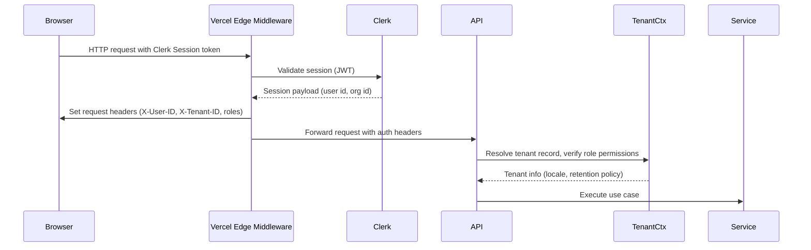

# Backend Architecture

## Service Architecture

```text
apps/web/src/app/api/
  reconciliations/
    route.ts          # POST (create draft)
  reconciliations/[id]/
    route.ts          # GET / PATCH / POST submit
  cash-sessions/
    route.ts          # GET / POST open
    [sessionId]/close/route.ts
  inventory/items/
    route.ts          # GET / POST
    [itemId]/route.ts # PATCH
    [itemId]/counts/route.ts
  forecasts/
    snapshots/route.ts
    feedback/route.ts
  supplier-orders/
    route.ts
    [orderId]/receive/route.ts
  reports/cash-journal/route.ts
  audit-log/route.ts

apps/web/src/server/
  http/
    reconciliations.handler.ts
    cashSessions.handler.ts
    inventory.handler.ts
  middlewares/
    clerkAuth.ts
    tenantContext.ts
    rateLimit.ts
  services/
    reconciliation.service.ts
    inventory.service.ts
    forecasting.service.ts
    supplierOrder.service.ts
  repositories/
    cashReconciliationRepo.ts
    inventoryRepo.ts
    forecastRepo.ts
  events/
    publishInventoryEvent.ts
    publishForecastEvent.ts
  utils/
    auditLogger.ts
    errorMapper.ts
```

```typescript
// apps/web/src/app/api/reconciliations/route.ts
import { NextRequest } from 'next/server';
import { createApiHandler } from '@/server/http/createHandler';
import { clerkAuth } from '@/server/middlewares/clerkAuth';
import { tenantContext } from '@/server/middlewares/tenantContext';
import { reconciliationService } from '@/server/services/reconciliation.service';
import { createReconciliationSchema } from '@pharmasaas/domain/reconciliation';

export const POST = createApiHandler({
  middlewares: [clerkAuth, tenantContext],
  input: createReconciliationSchema,
  action: async ({ user, tenant, input }) => {
    return reconciliationService.createDraft({
      tenantId: tenant.id,
      initiatedBy: user.id,
      cashSessionId: input.cashSessionId,
      countedTotals: input.countedTotals,
    });
  },
});
```

## Database Architecture

```typescript
// packages/domain/reconciliation/reconciliation.service.ts
import { ulid } from 'ulid';
import { CashReconciliationRepository } from '@pharmasaas/db/repositories/cashReconciliationRepo';
import { AuditLogger } from '@/server/utils/auditLogger';
import { ConvexPublisher } from '@/server/events/publishInventoryEvent';
import { calculateVariance } from './calculateVariance';

class ReconciliationService {
  constructor(
    private readonly repo: CashReconciliationRepository,
    private readonly audit: AuditLogger,
    private readonly convex: ConvexPublisher
  ) {}

  async createDraft(input: {
    tenantId: string;
    cashSessionId: string;
    initiatedBy: string;
    countedTotals: CashBreakdown;
  }) {
    const reconciliationId = ulid();
    const variance = calculateVariance(input.countedTotals);

    await this.repo.createDraft({
      id: reconciliationId,
      tenantId: input.tenantId,
      cashSessionId: input.cashSessionId,
      initiatedBy: input.initiatedBy,
      countedTotals: input.countedTotals,
      variance,
    });

    await this.audit.log({
      tenantId: input.tenantId,
      eventType: 'reconciliation_started',
      resourceType: 'cash_reconciliation',
      resourceId: reconciliationId,
      performedBy: input.initiatedBy,
      metadata: { cashSessionId: input.cashSessionId, variance },
    });

    await this.convex.publish('reconciliationDraftCreated', {
      tenantId: input.tenantId,
      reconciliationId,
      cashSessionId: input.cashSessionId,
    });

    return { reconciliationId, variance };
  }

  async appendStep(input: {
    reconciliationId: string;
    performedBy: string;
    step: ResolutionStepInput;
  }) {
    const stepId = ulid();
    await this.repo.appendStep(input.reconciliationId, {
      id: stepId,
      type: input.step.type,
      description: input.step.description,
      amountImpact: input.step.amountImpact,
      performedBy: input.performedBy,
      metadata: input.step.metadata,
    });

    await this.audit.log({
      tenantId: input.step.tenantId,
      eventType: 'reconciliation_step',
      resourceType: 'cash_reconciliation',
      resourceId: input.reconciliationId,
      performedBy: input.performedBy,
      metadata: { stepId, stepType: input.step.type, amount: input.step.amountImpact },
    });

    await this.convex.publish('reconciliationStepAppended', {
      reconciliationId: input.reconciliationId,
      stepId,
    });
  }

  async close(input: { reconciliationId: string; approvedBy: string; tenantId: string }) {
    await this.repo.close(input.reconciliationId, input.approvedBy);
    await this.audit.log({
      tenantId: input.tenantId,
      eventType: 'reconciliation_closed',
      resourceType: 'cash_reconciliation',
      resourceId: input.reconciliationId,
      performedBy: input.approvedBy,
    });
    await this.convex.publish('reconciliationClosed', {
      tenantId: input.tenantId,
      reconciliationId: input.reconciliationId,
    });
  }
}

export const reconciliationService = new ReconciliationService(
  new CashReconciliationRepository(),
  new AuditLogger(),
  new ConvexPublisher()
);
```

## Authentication and Authorization



```typescript
// apps/web/src/server/middlewares/clerkAuth.ts
import { NextRequest } from 'next/server';
import { AuthError } from '@/server/utils/errors';

export async function clerkAuth(req: NextRequest) {
  const userId = req.headers.get('x-user-id');
  if (!userId) throw new AuthError('UNAUTHENTICATED');

  const role = req.headers.get('x-user-role');
  if (!role) throw new AuthError('ROLE_MISSING');

  return { id: userId, role };
}
```

```typescript
// apps/web/src/server/middlewares/tenantContext.ts
import { TenantRepository } from '@pharmasaas/db/repositories/tenantRepo';
import { AuthorizationError } from '@/server/utils/errors';

export async function tenantContext(req: Request, user: { id: string; role: UserRole }) {
  const tenantId = req.headers.get('x-tenant-id');
  if (!tenantId) throw new AuthorizationError('TENANT_HEADER_MISSING');

  const tenant = await TenantRepository.findById(tenantId);
  if (!tenant) throw new AuthorizationError('TENANT_NOT_FOUND');

  return tenant;
}
```

## Resilience Patterns

- **Retry & Backoff:** Wrap outbound requests to Clerk, Resend, and Convex admin APIs in a shared utility (`packages/clients/retry.ts`) that implements exponential backoff with jitter (max 5 attempts) and surfaces telemetry to Sentry. Forecast worker jobs detect transient Neon/Redis errors and reschedule via Upstash delayed queues.
- **Circuit Breakers:** Introduce `@pharmasaas/services/circuitBreaker` to short-circuit repeated external failures (e.g., Clerk outage) and trigger fallback UX (read-only mode, cached session data). Breakers auto-reset after healthy pings or manual ops override.
- **Graceful Degradation:** When Convex is unavailable, the UI drops to queued-offline mode and highlights limited functionality; reconciliation submissions fall back to REST API with queued mutations. Resend failures enqueue transactional emails for later retry and notify ops via Better Stack alert.
- **Backpressure & Queues:** Upstash Redis tracks job queue depth; thresholds emit alerts and temporarily slow ingestion (POS offline queue) to prevent overload. Railway worker auto-scales based on queue metrics and supports manual drain commands.
- **Health Probes:** `/healthz` endpoint aggregates dependency checks (Neon, Convex, Redis, Clerk) and is used by Vercel and Railway for automatic restarts when any probe fails.

## Scaling & Capacity Planning

- **Vercel Web Tier:** Target ≤50 ms render time on edge regions; configure concurrency limits (max 300 concurrent executions) and leverage ISR for dashboard summary pages. Autoscaling relies on Vercel regions; Cloudflare CDN shields static assets.
- **Convex:** Monitor function latency and subscription count; scale to dedicated plan once live tenants >5. Subscription fan-out kept under thresholds by aggregating per-tenant channels.
- **Railway Forecast Worker:** Horizontal scaling via worker count env (`WORKER_SCALE`); jobs partitioned per-tenant to avoid thundering herd. Upstash queue depth >500 triggers additional worker replicas.
- **Neon Postgres:** Start on compute size 1 with auto-suspend; upgrade to size 2 once TPS sustained >50. Read replica dedicated to analytics prevents reporting from impacting OLTP.
- **Capacity Reviews:** Monthly ops review adjusts plan tiers based on metrics (Vercel execution, Convex usage, Neon storage). Run load tests before onboarding cohorts >10 pharmacies.

**Rationale**
- Trade-offs: Kept backend within Next.js API routes to minimize deployment complexity; layering middlewares ensures consistent auth/tenant context across handlers while preserving ability to extract into dedicated service later. Convex publisher invoked from services to keep realtime pipeline updated without direct DB triggers.
- Assumptions: Vercel edge middleware populates identity headers after verifying Clerk session; Upstash rate limiter applied at middleware layer (not shown). Domain services remain stateless so they can be moved into separate serverless functions if needed.
- Validation: Need to confirm header propagation works for server actions as well as REST endpoints. Ensure audit logger writes hash chain sequentially (e.g., using advisory locks) to avoid collisions.

1. Proceed to next section  
2. Explain Reasoning (CoT Step-by-Step)  
3. Critique and Refine  
4. Assess Alignment with Overall Goals  
5. Identify Potential Risks and Unforeseen Issues  
6. Agile Team Perspective Shift  
7. Stakeholder Round Table  
8. Tree of Thoughts Deep Dive  
9. Challenge from Critical Perspective  

Select 1-9 or share feedback:
