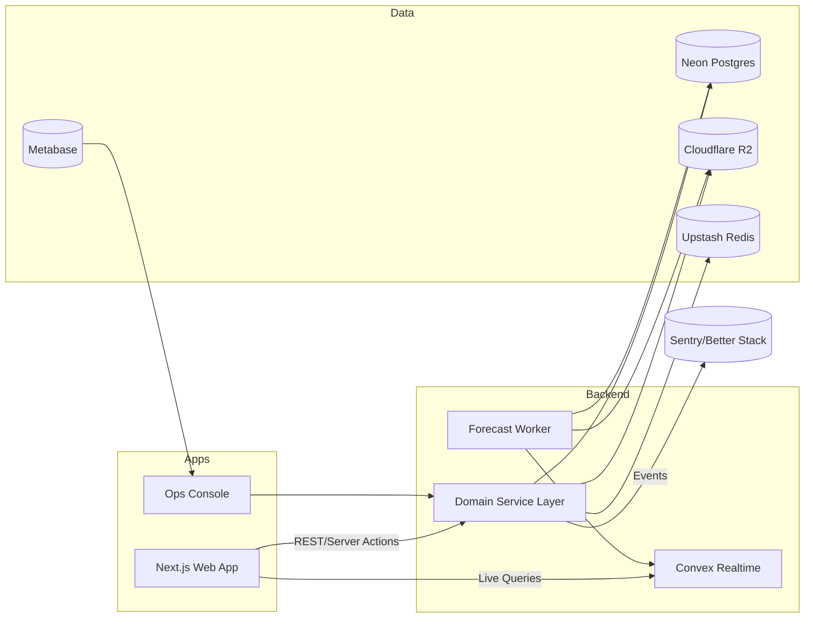

# Components

**Web App (Next.js)**
**Responsibility:** Render pharmacist dashboards, reconciliation wizard, POS workflows, and orchestrate API/Convex calls.

**Key Interfaces:**
- `GET/POST /api/*` via server actions and REST helpers
- Convex live queries/mutations for realtime data

**Dependencies:** Clerk middleware, shared UI/domain packages, TanStack Query cache

**Technology Stack:** Next.js 14 App Router, shadcn/ui, Tailwind, Convex client, TanStack Query

**Domain Service Layer**
**Responsibility:** Enforce business rules for cash handling, inventory, compliance, and persist data changes.

**Key Interfaces:**
- REST handlers under `/api` (Hono/Express-style)
- Drizzle repositories for Postgres access

**Dependencies:** Neon Postgres, Upstash Redis, Zod validators, Audit logger

**Technology Stack:** TypeScript, Drizzle ORM, Hono handlers inside Next API routes

**Convex Realtime Workspace**
**Responsibility:** Maintain live state (cash session dashboards, offline queue) and distribute optimistic updates.

**Key Interfaces:**
- Convex queries (`cashSessionLive`, `inventoryAlerts`)
- Convex mutations for offline transaction replay

**Dependencies:** Postgres via service layer webhooks, Clerk auth integration

**Technology Stack:** Convex functions, auth middleware, TypeScript schemas

**Forecast & Analytics Worker**
**Responsibility:** Generate demand forecasts, reconcile feedback, and publish recommendations.

**Key Interfaces:**
- Postgres (feature views, snapshots)
- Convex publish hooks for alert cards
- R2 storage for model artifacts

**Dependencies:** Upstash Redis event queue, Metabase for telemetry

**Technology Stack:** Python 3.12, Prophet, scikit-learn, Railway deployment

**Data Platform & Storage**
**Responsibility:** Persist transactional, audit, and document data with compliance guarantees.

**Key Interfaces:**
- Drizzle migrations & SQL views
- R2 storage operations

**Dependencies:** Neon branching for previews, hash-chain audit triggers

**Technology Stack:** Neon PostgreSQL 15, Cloudflare R2, SQL functions

**Observability & Ops Console**
**Responsibility:** Aggregate logs/metrics, provide dashboards, and run operational scripts.

**Key Interfaces:**
- Sentry SDK, Better Stack ingestion
- Metabase dashboards hitting read replica
- Internal ops console UI for QA

**Dependencies:** GitHub Actions alerts, Terraform-managed secrets

**Technology Stack:** Sentry, Better Stack Logtail, Metabase Cloud, lightweight Next.js admin app

