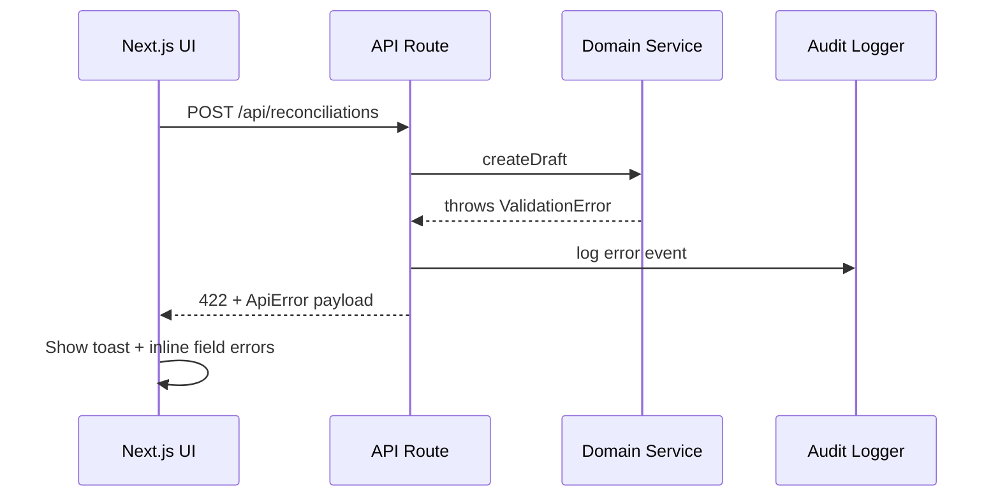

# Error Handling Strategy



```typescript
interface ApiError {
  error: {
    code: string;
    message: string;
    details?: Record<string, any>;
    timestamp: string;
    requestId: string;
  };
}
```

```typescript
// apps/web/src/server/utils/errorMapper.ts
import { NextResponse } from 'next/server';
import { ValidationError, AuthorizationError, DomainError } from '@pharmasaas/domain/errors';

export function mapError(err: unknown) {
  const timestamp = new Date().toISOString();
  const requestId = crypto.randomUUID();

  if (err instanceof ValidationError) {
    return NextResponse.json<ApiError>(
      { error: { code: 'VALIDATION_ERROR', message: err.message, details: err.details, timestamp, requestId } },
      { status: 422 }
    );
  }

  if (err instanceof AuthorizationError) {
    return NextResponse.json<ApiError>(
      { error: { code: 'FORBIDDEN', message: 'Accès refusé.', timestamp, requestId } },
      { status: 403 }
    );
  }

  if (err instanceof DomainError) {
    return NextResponse.json<ApiError>(
      { error: { code: err.code ?? 'DOMAIN_ERROR', message: err.message, timestamp, requestId } },
      { status: err.status ?? 409 }
    );
  }

  console.error({ requestId, err });
  return NextResponse.json<ApiError>(
    { error: { code: 'INTERNAL_ERROR', message: "Une erreur inattendue s'est produite.", timestamp, requestId } },
    { status: 500 }
  );
}
```

```typescript
// apps/web/src/features/reconciliation/hooks/useSubmitReconciliation.ts
import { useMutation } from '@tanstack/react-query';
import { toast } from '@/components/ui/toast';

export function useSubmitReconciliation() {
  return useMutation(submitReconciliation, {
    onError: (error: ApiError) => {
      toast.error(error.error.message, { description: error.error.code });
    },
  });
}
```

**Rationale**
- Trade-offs: Centralized mapper ensures consistent localization + audit logging without duplicating code in each handler. Request IDs feed into Sentry for cross-correlation.
- Assumptions: Domain errors include `code/status`; toast component handles localization fallback.
