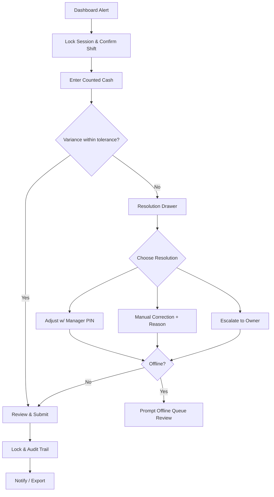
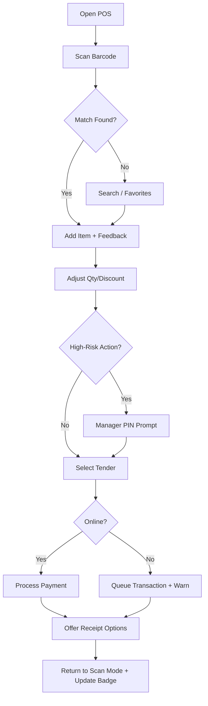
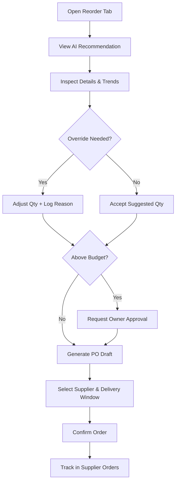

# PharmaSaaS UI/UX Specification

## Introduction

This document defines the user experience goals, information architecture, user flows, and visual design specifications for PharmaSaaS's user interface. It serves as the foundation for visual design and frontend development, ensuring a cohesive and user-centered experience.

### Overall UX Goals & Principles

**Target User Personas**
- **Pharmacy Owner-Operator:** Oversees profitability and compliance; needs a high-level cockpit to spot cash discrepancies and monitor KPIs without digging through spreadsheets.
- **Operations Manager / Lead Technician:** Runs day-to-day reconciliation, inventory counts, and supplier coordination; requires guided workflows that reduce manual effort and mistakes.
- **Counter Staff / Cashiers:** Capture sales on the POS; need rapid barcode flows, French-first copy, and guardrails against recording errors.

**Usability Goals**
- New pharmacy staff can finish the first daily cash reconciliation within 15 minutes of onboarding.
- Returning users resolve flagged discrepancies in under 5 guided steps with clear messaging.
- Inventory updates (receiving, expiry tracking) require no more than three screens and minimal typing for common cases.
- Core POS actions remain fully usable and legible on 7" tablets in French without horizontal scrolling.

**Design Principles**
1. **Guided Confidence:** Every critical workflow surfaces the next best action and explains why it matters, reducing anxiety during audits.
2. **Data with Trust Signals:** Metrics, alerts, and AI insights include context (source, freshness, suggested follow-up) to reinforce credibility.
3. **Calm Task Hierarchy:** Primary actions and alerts stand out; supporting data recedes to avoid dashboard overload.
4. **French-First Clarity:** Microcopy, help text, and error states stay bilingual-ready with French as the authoritative source.
5. **Responsive Rituals:** Interaction patterns flex gracefully from desktop to tablet while preserving muscle memory for repeat tasks.

### Change Log
| Date       | Version | Description                 | Author |
|------------|---------|-----------------------------|--------|
| 2025-10-22 | 0.1     | Initial UX goals definition | UX     |

## Information Architecture (IA)

### Site Map / Screen Inventory

```mermaid
graph TD
    ROOT[PharmaSaaS Shell]

    ROOT --> D[Dashboard]
    D --> D1[Cash & Profit KPIs]
    D --> D2[Alerts & Tasks]
    D --> D3[Forecast Highlights]
    D --> D4[Deep Forecast Workspace]

    ROOT --> R[Reconciliation]
    R --> R1[Daily Cash Wizard]
    R --> R2[Discrepancy Resolution Drawer]
    R --> R3[Adjustment History]

    ROOT --> I[Inventory & Suppliers]
    I --> I1[Catalog Table]
    I --> I2[Batch/Expiry Tracker]
    I --> I3[Reorder Recommendations]
    I --> I4[Supplier Orders]

    ROOT --> P[POS / Sales]
    P --> P1[Live Checkout]
    P --> P2[Offline Queue Manager]
    P --> P3[Receipt History]

    ROOT --> RP[Reports & Compliance]
    RP --> RP1[Cash Journal]
    RP --> RP2[VAT Export]
    RP --> RP3[Audit Trail]

    ROOT --> S[Admin Console]
    S --> S1[User Roles & Permissions]
    S --> S2[Localization Settings]
    S --> S3[Integrations & API Keys]
```

### Navigation Structure

**Primary Navigation:** Dynamic rail tuned to user role.
- **Owner/Manager:** Dashboard, Reconciliation, Inventory, Reports, Admin Console.
- **Counter Staff:** Dashboard, POS, Reconciliation (when on duty), plus shortcut to Offline Queue; Reports/Admin hidden unless permissioned.
Forecast Workspace surfaces as a persistent card in Dashboard with secondary access via Reports > Analytics for users who rely on projections.

**Secondary Navigation:** Contextual tabs within Inventory (Catalog, Suppliers, Batches, Reorders) and Reports (Financial, Compliance, Exports, Forecast Analytics). Reconciliation relies on a stepper with labeled stages; POS exposes a top-level toggle between Live Checkout and Offline Queue.

**Breadcrumb Strategy:** Breadcrumbs appear only on drill-down pages beyond level 2 (e.g., Inventory › Catalog › Paracetamol › Batch 2025-08) and follow a consistent “Section › Subsection › Entity” pattern. Primary workflow screens (Dashboard, POS, Reconciliation wizard) omit breadcrumbs to avoid clutter.

## User Flows

### Daily Cash Reconciliation

1. Launch reconciliation from Dashboard alert; session locks to current user to avoid duplicate counts.
2. Confirm register/shift context; variance tolerance banner exposes thresholds and last sync time.
3. Enter counted cash via large-type keypad (bills/coins, digital tenders, adjustments).
4. System compares expected vs counted totals.
5. If variance within tolerance, jump to review; otherwise open Resolution Drawer showing AI hypothesis, supporting transactions, and confidence meter.
6. Choose path: adjust transaction (manager PIN if variance exceeds threshold), log manual correction with required reason codes, or escalate to owner with message.
7. If offline, block submission until connectivity restored or offer Offline Queue link to review pending POS entries.
8. Review summary, attach notes, and submit; system locks results, timestamps the audit trail, and queues notifications for escalations or large adjustments.

**Assumptions & Mitigations**
- Variance thresholds configurable per store; messaging clarifies source of AI suggestions.
- Session locking prevents concurrent counts; admin override available via Admin Console.
- Offline guardrail ensures discrepancies aren’t resolved before queued sales sync.

### POS Live Checkout

1. Cashier opens POS (scan-ready; pending offline transactions badge visible).
2. Scan barcode; audible confirmation and haptic feedback (tablet) reinforce success.
3. If barcode fails, use search/favorites; system logs retry reason to improve catalog.
4. Adjust quantity/discount; high-risk actions prompt manager PIN modal without leaving flow.
5. Select tender type; interface flags split payments and enforces required metadata.
6. Connectivity check determines whether to process immediately or queue with warning banner.
7. Offer receipt (print/SMS/email/none) and log choice.
8. Return to scan-ready state; badge increments if sale queued offline, with “Review Offline Queue” quick action.

**Edge Cases**
- Offline queue accessible via badge; permissions allow managers to reconcile queued sales.
- Accessibility: tender buttons sized for touch, French labels default with room for bilingual toggles.
- Fraud controls balanced with speed via inline modal rather than redirect.

### Inventory Reorder Recommendation

1. Operations manager opens Inventory › Reorder; top banner shows SKUs near reorder points.
2. AI recommendation card displays suggested quantity, rationale (sales trend, expiry, safety stock), and confidence band.
3. Inspect detail drawer (batch expiries, supplier pricing, upcoming promotions calendar).
4. Adjust quantities or mark overrides; system logs reason for analytics.
5. If order exceeds budget threshold, flow prompts owner approval request (notify via email/in-app).
6. Generate purchase order draft tied to preferred supplier; select delivery window and fallback supplier if primary out-of-stock.
7. Confirm order; status tracked in Supplier Orders with reconciliation hook when goods received.

**Considerations**
- Approval step ensures compliance for large purchases.
- Alternative supplier selection mitigates out-of-stock scenarios.
- Overrides feed back into AI model to refine future recommendations.

## Component Library / Design System

**Design System Approach:** Build a PharmaSaaS-branded system atop Tailwind tokens and shadcn/ui primitives, extending them with pharmacy-specific patterns (wizards, alerts, forecast cards) while keeping implementation aligned with the existing React stack.

### Form Validation & Error Handling
- Shared validation schema library lives in `packages/config/validation` and re-exports Zod schemas shared with backend DTOs; every form consumes these schemas via the `useZodForm` hook.
- Error surfacing pattern: primary field error inline with helper text, summary banner at top for submission failures, and toast for cross-cutting incidents (e.g., permission changes).
- Loading/disabled states: submit button shows progress spinner, fields disable while optimistic mutation runs, and success resets form via shared `resetOnSuccess` helper.
- Accessibility: associate errors with inputs through `aria-describedby`, ensure French-first copy stored in `docs/user/messaging.md`, and keep color contrast ≥ 4.5:1.
- Testing: Storybook stories include invalid state, and Vitest unit specs assert schema rejections map to correct UI states (see `apps/web/tests/unit/forms/*`).

### Core Components

**App Shell**
- **Purpose:** Provides persistent scaffold with responsive navigation, header KPIs, and workspace canvas.
- **Variants:** Desktop rail, tablet bottom sheet, compact overlay for modals.
- **States:** Default, role-pruned (counter staff), collapsed nav, high-contrast mode.
- **Usage Guidelines:** Maintain consistent breadcrumb and quick-action placement; keep nav labels under 20 characters; collapse automatically below 1024px.

**Wizard Stepper**
- **Purpose:** Guides users through multi-step workflows such as daily reconciliation.
- **Variants:** Horizontal numbered (desktop), vertical stacked (tablet), minimal pill for tight spaces.
- **States:** Upcoming, current, completed, blocked (awaiting manager PIN).
- **Usage Guidelines:** Always pair steps with succinct summaries; show completion badges when variance resolved; avoid more than 6 steps.

**Alert Banner & Toasts**
- **Purpose:** Communicates system status (variance alerts, offline mode, overdue tasks).
- **Variants:** Inline banner, sticky footer, toast.
- **States:** Info, success, warning, error, offline.
- **Usage Guidelines:** Only one high-severity banner at a time; include action links (e.g., “Review Offline Queue”); auto-dismiss informational toasts after 6s.

**Data Card (KPI / Forecast)**
- **Purpose:** Display key metrics and AI insights on dashboard.
- **Variants:** KPI summary, forecast with trend sparkline, variance spotlight.
- **States:** Normal, improving, declining, unknown (insufficient data).
- **Usage Guidelines:** Surface context (last updated, confidence); cap cards per row at 3; ensure color coding aligns with accessibility contrast.

**Drawer / Side Panel**
- **Purpose:** Allows in-flow detail or resolution (discrepancy resolution, item details).
- **Variants:** Wide resolution drawer, narrow detail drawer, full-height mobile sheet.
- **States:** Idle, loading, error, success logged.
- **Usage Guidelines:** Keep primary action at bottom; provide inline help/tooltips; support keyboard focus trap.

**Table with Smart Filters**
- **Purpose:** Lists inventory, transactions, audit trails with dense data.
- **Variants:** Inventory catalog, supplier orders, audit logs.
- **States:** Default, filtered, empty, loading, bulk-select active.
- **Usage Guidelines:** Sticky headers; responsive collapse to cards on mobile; include export control with permission checks.

**POS Tender Pad**
- **Purpose:** Captures payment method selection and amounts quickly.
- **Variants:** Cash-first, card-first, mixed payment split.
- **States:** Default, offline warning, manager override required, error (insufficient amount).
- **Usage Guidelines:** Large buttons (minimum 44px height), show pending amounts clearly, minimize modal stacking.

**Offline Queue Badge**
- **Purpose:** Signals queued transactions and offers quick access to manage them.
- **Variants:** Header badge, POS badge, dashboard alert.
- **States:** None, low (1-3), high (4+), syncing.
- **Usage Guidelines:** Badge color shifts to warning when high; clicking opens queue drawer; include timestamp of oldest queued sale.

**Approval Chip**
- **Purpose:** Marks actions awaiting owner approval (large adjustments, purchase orders).
- **Variants:** Pending, approved, rejected, escalated.
- **States:** Default, hover, focus, disabled.
- **Usage Guidelines:** Pair with tooltips showing requester and timestamp; ensure inline placement near action controls.

## Branding & Style Guide

**Brand Guidelines:** Internal draft — derive from PharmaSaaS “calm control” palette; primary reference is forthcoming style tile (to be uploaded to Figma project `PharmaSaaS Brand v0.1`).

### Color Palette

| Color Type | Hex Code | Usage |
|------------|----------|-------|
| Primary | `#146A6C` | Core actions, headers, navigation accents |
| Secondary | `#1F3F5B` | Dashboard backgrounds, charts, data frames |
| Accent | `#E0A826` | Forecast highlights, guided step indicators |
| Success | `#2EAF74` | Positive confirmations, “in balance” states |
| Warning | `#F2B705` | Variance alerts under tolerance, expiring batches |
| Error | `#D64550` | Discrepancy failures, destructive actions |
| Neutral | `#101B24 / #6B7A86 / #F4F6F8` | Text hierarchy, borders, surface layers |

### Typography

- **Primary:** Inter (supports French accents, legible for dense dashboards)
- **Secondary:** Source Serif 4 for occasional highlights (e.g., forecast insight callouts)
- **Monospace:** JetBrains Mono for codes, batch IDs

| Element | Size | Weight | Line Height |
|---------|------|--------|-------------|
| H1 | 32px | 700 | 40px |
| H2 | 24px | 600 | 32px |
| H3 | 20px | 600 | 28px |
| Body | 16px | 400 | 24px |
| Small | 14px | 500 | 20px |

### Iconography

**Icon Library:** Phosphor Icons (filled + outline set, matches shadcn defaults)  
**Usage Guidelines:** Use outline icons for navigation and filled icons for stateful alerts; maintain consistent stroke (1.5px); ensure tooltips/localized labels accompany icons-only controls.

### Spacing & Layout

**Grid System:** 12-column fluid grid at ≥1280px; collapses to 8 columns on tablet, 4 columns on mobile.  
**Spacing Scale:** 4px base (4, 8, 12, 16, 20, 24, 32, 40, 48, 64); critical forms use multiples of 8 for alignment with Tailwind tokens.

## Accessibility Requirements

### Compliance Target

**Standard:** WCAG 2.2 Level AA.

### Key Requirements

**Visual**
- Color contrast ratios: Minimum 4.5:1 for text, 3:1 for large display numbers; ensure colorblind-friendly palette for KPI diff states.
- Focus indicators: Persistent 2px outline with 3:1 contrast; avoid relying solely on color to denote focus.
- Text sizing: Base 16px; allow zoom up to 200% without layout breakage; provide adjustable table density.

**Interaction**
- Keyboard navigation: Tab order follows visual hierarchy; wizards support arrow navigation; shortcuts exposed for power users but never mandatory.
- Screen reader support: Landmarks for main sections, ARIA labels on drawer controls, announce variance results and AI confidence levels.
- Touch targets: Minimum 44px hit area; ensure tender buttons and approval chips respect this on tablet.

**Content**
- Alternative text: Dashboard charts include textual summaries and inline sparklines with accessible descriptions.
- Heading structure: H1-H3 follow logical nesting; skip-level jumps avoided.
- Form labels: Persistent labels above fields; helper text explains expected units (e.g., MAD, quantity).

### Testing Strategy

Quarterly accessibility audits combining automated scans (axe, Lighthouse) and manual screen-reader passes (NVDA + VoiceOver). Each major release runs focused usability testing with at least one low-vision user and one keyboard-only user; findings logged in QA gate per story.

## Responsiveness Strategy

### Breakpoints

| Breakpoint | Min Width | Max Width | Target Devices |
|------------|-----------|-----------|----------------|
| Mobile | 320px | 640px | Smartphones used during walk-throughs or quick lookups |
| Tablet | 641px | 1024px | 7–10" tablets at the counter or back office |
| Desktop | 1025px | 1440px | Primary workstation in pharmacy/office |
| Wide | 1441px | – | Large monitors in multi-location HQ or dashboards on TVs |

### Adaptation Patterns

**Layout Changes:** Dashboard cards stack 1-column on mobile, 2-column on tablet, 3-column desktop; reconciliation wizard uses stacked panels on mobile versus side-by-side summary on desktop. Tables convert to responsive cards or allow horizontal scroll with sticky headers on tablet.

**Navigation Changes:** Primary nav becomes bottom tab bar on tablet/mobile for staff; secondary context switches to top segmented controls. Hamburger menu reveals Admin Console options for authorized users.

**Content Priority:** Mobile surfaces alerts, quick actions, and offline queue access first; advanced analytics hide behind expandable sections. Desktop retains full KPI suite and multitasking panes.

**Interaction Changes:** Drag-and-drop (batch reordering) disabled on mobile; gestures replaced with explicit buttons. Hover tooltips convert to tap-activated info pills. Long forms offer save-as-draft reminders for mobile sessions.

## Animation & Micro-interactions

### Motion Principles

- **Purposeful Calm:** Motion only highlights state changes (variance resolved, POS success) and stays under 250ms to maintain trust in financial workflows.
- **Directional Guidance:** Use slide/scale transitions to indicate navigation hierarchy (drawers slide from right, modals from bottom on mobile).
- **Accessible Feedback:** Provide simultaneous non-motion cues (color, text) and allow users to disable reduced motion via OS preference detection.

### Key Animations

- **Reconciliation Step Progress:** Slide + fade transition between wizard steps (200ms ease-out) with progress indicator filling smoothly to signal advancement.
- **POS Scan Confirmation:** Brief rate-limited pulse on line item row plus subtle success chime; duration 150ms, ease-in-out.
- **Offline Queue Alert:** Badge bounces gently (once every 8s) when new queued transactions appear; honors reduced-motion setting.
- **AI Recommendation Reveal:** Expand/collapse with 180ms ease-out when users inspect rationale, ensuring content shift feels controlled.
- **Discrepancy Resolution Success:** Drawer compresses with fade and success icon scales up (120ms) before the summary page appears, reinforcing closure.

## Performance Considerations

### Performance Goals

- **Page Load:** ≤2.0s First Contentful Paint on 3G.
- **Interaction Response:** ≤150ms feedback for POS scans and reconciliation step transitions.
- **Animation FPS:** Maintain 60fps on target tablets; gracefully degrade to 30fps if reduced-motion enabled.

### Design Strategies

Prioritize lightweight dashboards by lazy-loading deep analytics panels; use skeleton loaders instead of spinners for perceived speed. Limit simultaneous chart renders to avoid blocking DOM. For POS and reconciliation, cache most recent data locally to support offline/fast resume states. Microcopy should set expectations (“Syncing transactions…”) when operations may exceed targets.

## Next Steps

### Immediate Actions

1. Align with Product/Engineering on session locking, RBAC-driven navigation, and offline queue technical feasibility.
2. Produce low-fidelity wireframes for Dashboard, Reconciliation, POS, and Reorder screens to validate flows with pharmacists.
3. Build token inventory (color, spacing, typography) in shared Figma file and sync with Tailwind configuration.
4. Schedule moderated usability walkthrough with representative pharmacist roles to test reconciliation wizard prototype.

### Design Handoff Checklist

- [ ] All user flows documented
- [ ] Component inventory complete
- [ ] Accessibility requirements defined
- [ ] Responsive strategy clear
- [ ] Brand guidelines incorporated
- [ ] Performance goals established

## Checklist Results

No formal UI/UX checklist run yet; complete once wireframes and tokens are reviewed.
